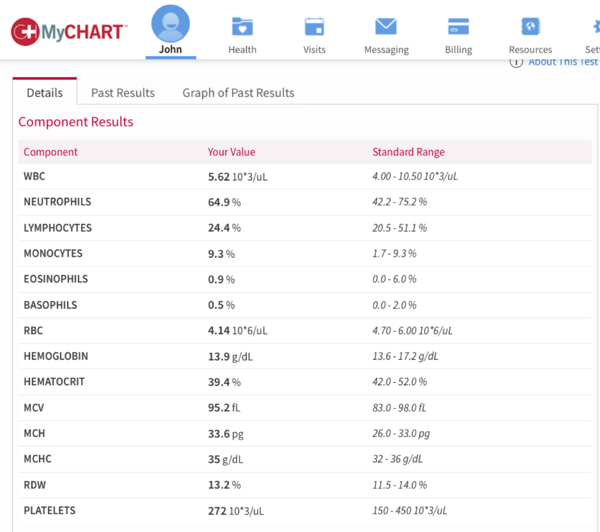

\cleardoublepage 


```{r, echo=FALSE, message=FALSE}
library(knitr)
library(ggrepel)
library(tidyverse)
```

# Introduction: Audiences, purposes, questions {#Introduction}

Information technology has brought large volumes of data and the promise of a deeper understanding of a wide range of challenges from understanding the quarterly performance of a company to the effectiveness of a healthcare system or the health of an individual. Often this promise is not kept and data overwhelms rather than informs. Often a well-crafted visualization can address this problem and make data meaningful. This book provides principles and examples to make large volumes of data meaningful through visualization.

The book combines general visualization principles illustrated with examples.  It also includes the computer code so that each graph can be reporduced and used to plot other data. Nearly all the examples use ggplot2 which makes it relatively easy to replicate some of the classic visualization suggestions of E. Tufte, such as his minimalitic graph styles, as well as slope graphs (Section \@ref(tufte-slopegraph)) and small multiples (Section \@ref(tufte-smallmultiples)).

The book also includes ways of addressing common challenges with ggplot2, such as removing legend (Section \@ref(AddingRemovingLabels)) and reordering categories of column charts.


## Seeing meaning rather than numbers

Figure \@ref(fig:blood-tab) shows a typical report of a medical diagnostic test. The numerical summary shows the patient's values and the range of standard values. The information is there to show if a patient is dangerously outside the range, but a quick glance at the table might miss these indications. Even a careful reading of the table might miss warning signs, particularly if the critical information is in the trend that requires looking at a second table on another tab. Figure \@ref(fig:blood-vis) shows the data relative to the high and low normal range and makes deviations much more apparent. The ghosted points show past results and roughly indicate trends.


```{r blood-tab, echo = FALSE, fig.cap = "A typical report of a medical test makes finding deviations from the normal range difficult."}

```


```{r blood-vis, fig.cap= "A visualization of the same results makes the deviations pop out.", , out.extra='', echo=FALSE}
#TODO move facet label to top left
blood.df = data.frame(measure = c("WBC (10*3/uL)", "Neutriphils (%)", 
                                  "Lymphocytes (%)", "Monocytes (%)",
                                  "Eosinophils (%)", "Basophils (%)",
                                  "RBC (10*6/uL)", "Hemoglobin (g/dL)",
                                  "Hemotocrit (g/dL)", "MCV (fL)",
                                  "MCH (pg)", "MCHC (g/dL)",
                                  "RDW", "Platelets (10*3/uL)"),
                      type = c("immune", "immune", "immune", "immune", "immune", "immune",
                               "redcells", "redcells", "redcells", 
                               "redcells",
                               "redcells", "redcells", "redcells", "redcells"),
                      order = c(1, 2, 3, 4, 5, 6, 7, 8, 9, 10, 11, 12, 13, 14),
                      value = c(5.62, 64.9, 
                                24.4, 9.3,
                                .9, .5,
                                4.1, 13.9,
                                39.4, 95.2,
                                33.6, 35,
                                13.2, 272),
                      lo = c(4, 42.2, 
                             20.5, 1.7,
                             0, 0,
                             4.7, 13.6,
                             42.0, 83,
                             26.0, 32,
                             11.5, 150),
                      hi = c(10.5, 75.2, 
                             51.1, 9.3,
                             6.0, 2.0,
                             6.0, 17.2,
                             52.0, 98.0,
                             33.0, 36,
                             14, 450)
                      )

s.blood.df = blood.df %>% mutate(s.value = (value-lo)/(hi-lo)) %>% 
  mutate(l1.s.value = (s.value-.5)/1.15 +.5) %>% # to show movement away from normal
  mutate(l2.s.value = (s.value-.5)/1.33 +.5) %>% # to show movement away from normal
  mutate(abnormal = ifelse(value<lo|value>=hi, TRUE, FALSE)) 


ggplot(s.blood.df, aes(reorder(measure, -order), s.value)) +
  geom_rect(xmin = -.5, xmax = 14.5,
            ymin = -.75, ymax = 0, 
            fill = "grey70", alpha = .05) +
  geom_rect(xmin = -.5, xmax = 14.5,
            ymin = 1.0, ymax = 1.75, 
            fill = "grey70", alpha = .05) +
  geom_text(aes(y = 0, label = lo), hjust = "inward", nudge_y = .005, alpha =.5, size = 3.3) +
  geom_text(aes(y = 1, label = hi), hjust = "inward", nudge_y = -.005, alpha =.5, size = 3.3) +
  #geom_line(aes(group = type), size = .33, alpha =.7) +
  geom_hline(yintercept = .5, linetype = "dashed", colour = "grey80")+
  geom_text(aes(label = value), nudge_x = .4) +
  geom_point(aes(y= l2.s.value, fill = abnormal), shape = 21, size = 1.5, alpha = .25) +
  geom_point(aes(y= l1.s.value, fill = abnormal), shape = 21, size = 2.5, alpha = .5) +
  geom_point(aes(fill = abnormal), shape = 21, size = 3.) +
  scale_fill_manual(values = c("white", "grey15"), guide = FALSE) +
  scale_y_continuous(breaks = NULL, limits = c(-.5, 1.5)) +
  coord_flip() +
  facet_grid(type~.,scales = "free_y")+
  labs(y = "", x = "") +
  theme_minimal(base_size = 10) +
  theme(strip.text = element_blank())

```


## Seeing more than summary statistics 
The easy availability of sophisticated machine learning and statistical models makes algorithmic interpretation of data tempting. However, such interpretations can mislead, with similar outcomes produced by very different underlying data.

Figure \@ref(fig:anscombe-vis) shows four distinct sets of data.  The differences are obvious when graphed.  One might expect that the typical summary statistics--mean, standard deviation, and correlation--would show equally stark differences.  Table \@ref(tab:anscombe-tab) shows this is not the case. Each data set has the same summary statistics.  

```{r anscombe-vis,  fig.cap = 'The Anscombe quartet and the limits of summary statistics.', echo = FALSE}

anscombe.df = anscombe %>% 
  gather(key = x, xvalue, x1:x4) %>% 
  gather(key = y, yvalue, y1:y4) %>% 
  mutate(x = substr(x, 2, 2), y = substr(y, 2, 2)) %>% 
  filter(y==x) %>% 
 # select(-x) %>% 
  rename(set = y)
  
anscombe.df$set = paste("Set", anscombe.df$set)

  
s.anscombe.df = anscombe.df %>% group_by(set) %>% 
  summarize(mean.y = mean(yvalue), sd.y = sd(yvalue), cor = cor(xvalue, yvalue))

ggplot(anscombe.df, aes(x = xvalue, y = yvalue)) + 
  geom_point() + 
  facet_wrap(~set) +
  labs(x = "", y = "")

```


```{r anscombe-tab, echo=FALSE}

kable(s.anscombe.df,  caption = 'Four seemingly identical datasets that illustrate the limits of algorithmic interpretation.',
      digits = 2, 
      col.names = c("Data set", "Mean", "Standard deviation", "Correlation"),
      booktabs = TRUE
      )

```

## Purposes and audiences of visualizations
What makes a "good" visualization depend on whether it is taylored to its purpose and its intended audience.  Generally graphs can serve three  general purposes--explore, inform, and engage [@Gelman2013]--and understanding what purpose the graph serves can help ensure the graph succedes. The purpose of the graph tends to depend on the audience, which can range from yourself, peers, scientists and engineers, managers, and the public. An extremely effective graph that you might use explore a dataset might fail to support peer in doing the same and might be completely inappropriate for presenting results to managers.  

Explore: the answer is unknown and audience is likely yourself and peers involved in the research.

Inform: the answer is known and the audience is likely a broader audience of scientists, engineers, or manager not direclty involved in the research.

Engage: the answer is known and must be communicated in an entertaining way to those who may might neet to be drawn into reading the graph and may not be familiar with conventions of scientific visualization, such as box plots.


## What question to answer?
Triadic perspective that links three distinct elements:
1. the person and their questions
2. the underlying data and its meaning
3. the graphical representation

This triadic perspective places equal emphasis on the analytics and processing of data and the visual representation that must be tailored to the motivation, needs and capacity of the people viewing the graph.

This requires:
1. Abstracting and aggregating (properties of the data) to address the intersts of the audience.11

2. matching types of graphs (visual representations) to types of questions (properties of the data)

3. matching types of graphs (visual representations) to the audience (properties of people, their interests, and experience)


  
## Storytelling with graphics

* High-level principles for communication, such as "Show don't tell"
* Role of annotation in going beyond the data: direct attention and explain, as in Table \@ref(tab:test).


Based on https://www.rdocumentation.org/packages/HistData/versions/0.8-4/topics/Minard

```{r, echo=FALSE, message=FALSE, warning=FALSE, cache=TRUE, fig.asp = 8.5/20.25}
library(HistData)
library(scales)
library(ggmap)
library(tidyverse)
library(gridExtra)
library(grid)
library(gtable)
#
# ## Match troop data to temperature data
# # Small difference in position require reconciliation
Minard.troops$survivors[Minard.troops$survivors==340000] = 422000 # Data don't match annotation on original plot
Minard.troop.temp = Minard.troops %>% filter(direction == "R") %>%
  filter(round(long, 0) %in% round(Minard.temp$long, 0)) %>%
  mutate(long = round(long, 0)) %>% distinct(long, .keep_all = TRUE)

Minard.temp = Minard.temp %>% mutate(long = round(long, 0))


## Create map
# campaign_map = get_map(
#   location = c(min(Minard.troops$long)-1, min(Minard.troops$lat)-.5,
#                max(Minard.troops$long)+1, max(Minard.troops$lat)+.75),
#   maptype = "toner-lines", source = "stamen")
# save(file = "minard_map", campaign_map)

load(file = "minard_map")


# ## Plot troop path
troop.plot = ggmap(campaign_map) +
  geom_path(data = Minard.troops,
            aes(long, lat, size = (survivors)^1.33, colour = direction, group = group),
            lineend = "round", linejoin = "bevel") +
  geom_text(data = Minard.cities,
            aes(long, lat, label = city), size = 2.75) +
  geom_segment(data = Minard.troop.temp,
            aes(x = long, xend = long, y = lat, yend = -Inf), alpha = .33) +
  coord_cartesian(xlim = c(23.5, 38.5)) +
  scale_size_continuous("Survivors", range = c(.25, 12)) +
  scale_color_manual("Direction", values = c("grey75", "grey35")) +
  labs(title = "Napoleon's March on Moscow") +
  theme_void() +
  theme(legend.position = "none",
    legend.box="horizontal",
    plot.margin = unit(c(0, 1.5, 0, 0), "cm"))

#
# ## Plot temperature vs. longitude, with labels for dates
temp.plot = ggplot(Minard.temp, aes(long, temp)) +
  geom_path(color = "grey75", size=1) +
  geom_point(size=1) +
  geom_segment(aes(x = long, xend = long, y = temp, yend = Inf), alpha = .33) +
  geom_text(aes(label=paste(temp, "°", " ", date, sep = "")), nudge_y = -4, size = 3) +
  labs(x= "", y = "Temp. (C°)") +
  scale_y_continuous(position = "right") +
  coord_cartesian(xlim = c(24.2, 38.15), ylim = c(-36, 5)) +
  theme_minimal() +
  theme(plot.margin = unit(c(0, .175, 0, 0), "cm"),
        axis.title.y = element_text(size = rel(.8)),
         panel.grid.minor = element_blank(),
        axis.text.x=element_blank(),
        axis.ticks.x=element_blank())

# ## Combine the plots
p1 = ggplot_gtable(ggplot_build(troop.plot))
p2 = ggplot_gtable(ggplot_build(temp.plot))

maxWidth = unit.pmax(p1$widths[2:3], p2$widths[2:3])
p1$widths[2:3] <- maxWidth
p2$widths[2:3] <- maxWidth

grid.arrange(p1, p2, heights = c(4, 1.5))

# library(cowplot)
# plot_grid(troop.plot, temp.plot,
#           nrow = 2,
#           rel_heights = c(4, 1.5), axis = "l")
# library(ggpubr)
# ggarrange(troop.plot, temp.plot,
#           nrow = 2,
#           heights = c(4, 1.5), align = "v")
```


## Data sources
This book uses data from the following sources:

Work and life activity:
American Time Use Survey (ATUS) 
https://www.bls.gov/tus/
https://cran.r-project.org/web/packages/atus/atus.pdf

O*NET occupational information: knowledge, skills, abilties, task composition
https://www.onetonline.org


Accident data: Occupational injury, motor vehicle crashes
Babynames
Sleep data
Healthcare:
Taste: Wine, chocolate


https://www.kaggle.com

https://www.data.gov Consumer complaint database, NTSB accident database

https://flowingdata.com/category/projects/data-underload/

http://www.wolframalpha.com

R packages: HistData, babynames


Yao about data and web scraping and the package 

```{r, happiness-plot, cache=TRUE}

## Read data from website
# sports <- read_tsv("https://github.com/halhen/viz-pub/raw/master/sports-time-of-day/activity.tsv")


## Happiness

happiness.df = read.csv("data/world-happiness-report/2017.csv")

highlight.df = happiness.df %>% filter(
  Economy..GDP.per.Capita.>1.75|
  Happiness.Score>7.4|
  (Happiness.Score>5&Economy..GDP.per.Capita.<.5)|
  (Happiness.Score>6&Economy..GDP.per.Capita.<1)|
    Country=="United States")

ggplot(happiness.df, aes(Economy..GDP.per.Capita., Happiness.Score)) + 
  geom_point(colour = "grey25") +
  geom_point(data = highlight.df, color = "orange")+
  geom_text_repel(data = highlight.df, aes(label = Country))+
  labs(title = "Money doesn't buy happiness, but it helps", 
       subtitle = "Source: https://www.kaggle.com/unsdsn/world-happiness 2017",
       y = "Happiness", x = "Per capita GDP")

## Chocolate
# chocolate.df = read.csv("flavors_of_cacao.csv")
# chocolate.df$Cocoa.Percent = as.numeric(chocolate.df$Cocoa.Percent)
# ggplot(chocolate.df, aes(Cocoa.Percent, Rating)) + geom_point()


## Police
## 2535 observations, Age, gender, how armed, state, threat, body cameraAll factors
 police.df = read.csv("data/PoliceKillingsUS.csv") 

# Canadian vehicle specifications: http://www.carsp.ca/research/resources/safety-sources/canadian-vehicle-specifications/
```


## Grammar of data manipulation
This book is not about data reduction and data wrangling. The tidyverse provides an intrgrated set of tools for data wrangling http://r4ds.had.co.nz.  

Filter, select, mutate summarise


## Grammar of graphics
Data, layers of geometric eleements, map and set aesthetic properties of each layer of geometric element locally or globally
Simple example


## Considering cognitive capabilities in graphic design
Capitalizing on power of visual perception
Same graph with out without consideration