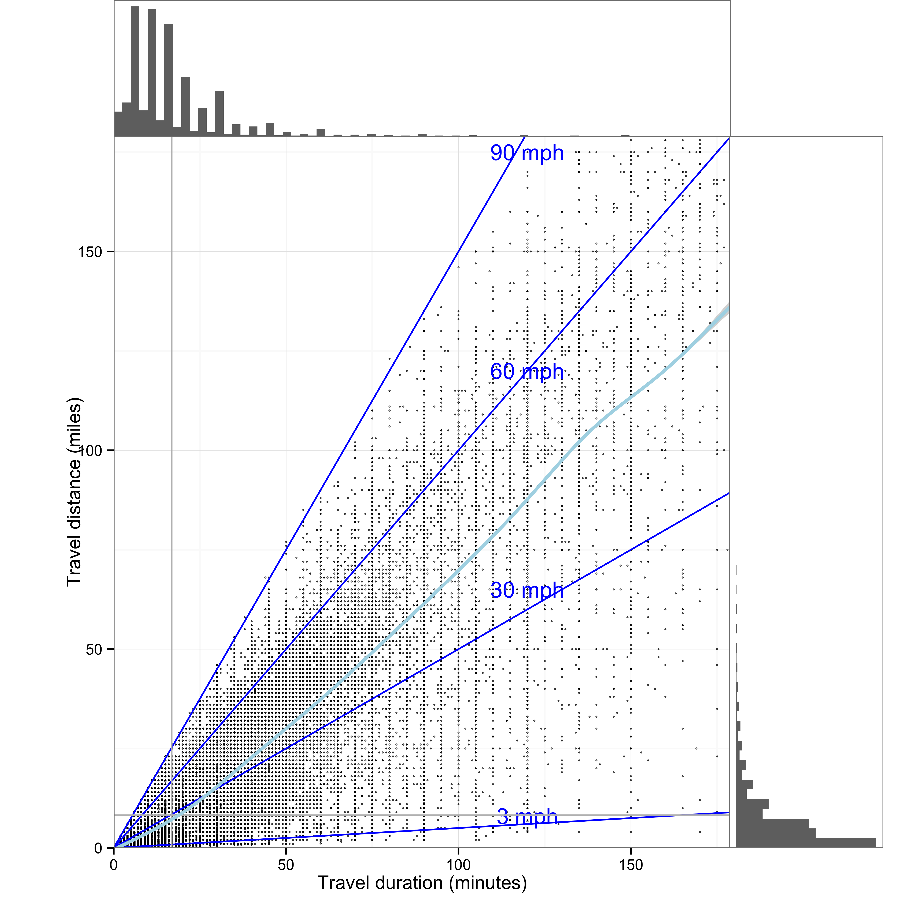

\cleardoublepage 

# Visualization types and principles {#Principles}


```{r graphtypes, echo=FALSE, message=FALSE, message=FALSE}

#### Icons of graph type for common comparisons

library(ggdendro)
library(tidyverse)
library(ggpubr)
library(knitr)
library(latticeExtra) # For 3-D bar graph
set.seed(66)

## Set default and create data
theme_set(
  theme_bw() + 
    theme(
      axis.text.x = element_blank(),
      axis.text.y = element_blank(),
      axis.ticks = element_blank(),
      axis.title.x = element_blank(),
      axis.title.y = element_blank(),
      panel.grid.major.x=element_blank(),
      panel.grid.major.y=element_blank(),
      panel.grid.minor.x=element_blank(),
      panel.grid.minor.y=element_blank(),
      plot.margin=unit(c(.1,.1,.1,0), "cm"),
     # panel.border = element_rect(fill = NA, colour = "black", size = 2),
      legend.position = "none",
      aspect.ratio = 1
      )
)

## Create data
x = rnorm(15)
y = 2*x+rnorm(15)+.5
data.df = data.frame(x, y)


#### Association: Scatterplot ####
scatter_plot = ggplot(data.df, aes(x, y)) + geom_point(size = .75) +
  geom_smooth(method= "lm", size = 1., colour= "black") 


#### Fluctuation: Timeline ####
timeline_plot = ggplot(data.df, aes(x, y))+geom_line(size=1)


#### Distribution: Dotplot, Histogram, Density, Model Density ####
dot.plot = ggplot(data.df, aes(x)) + geom_dotplot(binwidth = .5)
dot_85th.plot = ggplot(data.df, aes(x)) + geom_dotplot(aes(fill = x<.85), binwidth = .5) +
  scale_fill_manual(values = c("red", "grey20"), guide= FALSE) 

histogram_plot = ggplot(data.df, aes(x)) + geom_histogram(binwidth = .4) 

density.plot = ggplot(data.df, aes(x)) + geom_density(fill = "darkgrey") 

density_norm.plot = ggplot(data.df, aes(x)) + geom_density(fill = "darkgrey") +
                stat_function(fun = dnorm, args = list(mean = .3, sd = 1), colour = "black", size = 2.5)


#### Proportion: Stacked bar ####
x = rnorm(15)
y = 1.5*x+rnorm(15)+.5
data.df = data.frame(x, y)

l.data.df = gather(data = data.df, key = condition, value = size)
sum.l.data.df = l.data.df %>% mutate(d.measure = cut(size, breaks = 2, labels = c("Low", "High")))

stacked_bar_plot = ggplot(sum.l.data.df, aes(condition, fill = d.measure)) + geom_bar() +
  scale_fill_manual(values = c("grey", "grey15"))


#### Comparison: Boxplot ####
l.data.df = gather(data = data.df, key = condition, value = size)

box_plot = ggplot(l.data.df, aes(condition, size))+
  geom_boxplot(fill="grey15", size= 1., color = "grey15")+
  stat_summary(geom = "crossbar", width=0.9, fatten=2.5, color="white", 
               fun.data = function(x){ return(c(y=median(x), ymin=median(x), ymax=median(x)))})


#### Contribution: pareto plot  ####


# implementing the function:
ggpareto <- function(x) {
    library(dplyr)
  title <- deparse(substitute(x))
  x <- data.frame(modality = na.omit(x))
  
  Df <- x %>% group_by(modality) %>% summarise(frequency=n()) %>% 
    arrange(desc(frequency))
  
  Df$modality <- ordered(Df$modality, levels = unlist(Df$modality, use.names = F))
  
  Df <- Df %>% mutate(modality_int = as.integer(modality), 
                      cumfreq = cumsum(frequency), cumperc = cumfreq/nrow(x) * 100)
  nr <- nrow(Df)
  N <- sum(Df$frequency)
  
  Df_ticks <- data.frame(xtick0 = rep(nr +.55, 11), xtick1 = rep(nr +.59, 11), 
                         ytick = seq(0, N, N/10))
  
  y2 <- c("  0%", " 10%", " 20%", " 30%", " 40%", " 50%", " 60%", " 70%", " 80%", " 90%", "100%")
  
  library(ggplot2)
  
  g <- ggplot(Df, aes(x=modality, y=frequency)) + 
    geom_bar(stat="identity", aes(fill = modality_int)) +
    geom_line(aes(x=modality_int, y = cumfreq, color = modality_int)) +
    geom_point(aes(x=modality_int, y = cumfreq, color = modality_int), pch = 19) +
    scale_y_continuous(breaks=seq(0, N, N/10), limits=c(-.02 * N, N * 1.02)) + 
    scale_x_discrete(breaks = Df$modality) +
    guides(fill = FALSE, color = FALSE) +
    scale_fill_continuous(low="grey10", high="grey90")+
    scale_colour_continuous(low="grey10", high="grey90")
    #scale_fill_grey()
    #scale_colour_grey()#+scale_fill_grey()
    #annotate("rect", xmin = nr + .55, xmax = nr + 1, 
     #        ymin = -.02 * N, ymax = N * 1.02, fill = "white") +
   # annotate("text", x = nr + .8, y = seq(0, N, N/10), label = y2, size = 3.5) +
   # geom_segment(x = nr + .55, xend = nr + .55, y = -.02 * N, yend = N * 1.02, color = "grey50") +
   # geom_segment(data = Df_ticks, aes(x = xtick0, y = ytick, xend = xtick1, yend = ytick)) 
    #labs(title = paste0("Pareto Chart of ", title), y = "absolute frequency") +
    #theme_bw()
  
  return(list(graph = g, Df = Df[, c(3, 1, 2, 4, 5)]))
}

# applying the function to the factor variable:
# creating a factor variable:
Example <- rep(c(letters[1:2], LETTERS[1:3]), c(15, 39, 6, 42, 50))

pareto_plot = ggpareto(Example)


#### Connection: Network diagram ####
library(igraph)
library(reshape2)
gggraph <- function(g, vplace = rnorm) {
  require(ggplot2)
  g_ <- get.edgelist(g)
  g_df <- as.data.frame(g_)
  g_df$id <- 1:length(g_df[,1])
  g_df <- melt(g_df, id=3)
  xy_s <- data.frame(value = unique(g_df$value), 
                     x = vplace(length(unique(g_df$value))), 
                     y = vplace(length(unique(g_df$value))))
  g_df2 <- merge(g_df, xy_s, by = "value") 
  
  p <- ggplot(g_df2, aes(x, y)) +
    geom_point(size=1.5) +
    geom_line(size = .75, aes(group = id)) + #, linetype = factor(id)
    #geom_text(size = 4, hjust = 1.5, aes(label = value)) +
    theme_bw() + 
    theme(panel.grid.major=element_blank(), 
         panel.grid.minor=element_blank(), 
         axis.text.x=element_blank(),
         axis.text.y=element_blank(),
         axis.title.x=element_blank(),
         axis.title.y=element_blank(),
         axis.ticks=element_blank(),
        # panel.border = element_rect(fill = NA, colour = "black", size = 2),
         legend.position="none")
  p
}

g <- erdos.renyi.game(20, 12, type="gnm")
network_plot = gggraph(g, rnorm)


#### Hiearchy: dendrogram  ####
model <- hclust(dist(USArrests), "ave")
dhc <- as.dendrogram(model)

ddata <- dendro_data(dhc, type = "triangle")

dendro_plot = ggplot(segment(ddata)) + 
  geom_segment(aes(x = x, y = y, xend = xend, yend = yend))  
  #coord_flip() + 
  #scale_y_reverse(expand = c(0.2, 0)) +
  #theme_dendro()


#### Combined plots ####
type.plot = ggarrange(scatter_plot, histogram_plot, box_plot, 
                      stacked_bar_plot, timeline_plot, network_plot,
                      labels = c("Association", "Distribution", "Comparison",
                                 "Proportion", "Fluctuation", "Connection"),
                      nrow=2, ncol = 3, align = "hv")
type.plot

theme_set(theme_grey())
```


## Pairing questions and graph types


Graphs answer questions about data by showing relationships and making comparisons easier. Before creating a graph it is critical to specify the questions and comparisons of interest. Figure \@ref(fig:graphtypes) shows common graphs and general questions they might answer. For example, in the upper left is a graph that shows the association between variables. This type of graph answers questions such as "how does X influence Y?", as in "does increasing the prices of gas reduce the amount of driving?". A scatter plot shows the strength and nature of this association. Each graph in Figure \@ref(fig:graphtypes) is suited to a different question:


Graphs answer questions about data by showing relationships and making comparisons easier. Before creating a graph it is critical to specify the questions and comparisons of interest. Table \ref{tab:GraphTypes} shows common graphs and general questions they might answer. For example, in the upper left is a graph that shows the association between variables. This type of graph answers questions such as how does X influence Y, as in ``does increasing the prices of gas reduce the amount of driving?''. A scatter plot  shows the strength and nature of this association.  


* Association: What influences an outcome?
* Distribution: What is the spread of the observations?
* Comparision: How does one condition differ from another?
* Proportion: What is the size of the components that make up the whole?
* Fluctuation: How does the do observations vary over time?
* Connection: How are the observations connnected over a map or network?

Combinations of questions, such as changes in distribution or proportion over time 


Questions in terms of patterns vs precision

Graph type and familiarity, pie charts
Scatter plot to 2-density, comparison to ranking, dotplot to violin or boxplot.


Graph types and volume of data.  
More data requires abstraction. Some plots scale well others do not, overplotting one example of scaling challenges with increasingly large data.


More data points and more variables (e.g., time sequences, categories), organize chapters to move from few points and few variables to many (e.g., histogram to small multiple, to heatmap)

Types of data sets:
Number of observations (independent, sequential)
Number variables (nominal, ordinal, interval)

~50 observations and 5 nominal and 7 interval variables (mtcars, IIHS vehicle fatalities)
~50 observations and 1 nominal and 4 interval variables (iris)
~200 observations and 2 nominal and interval variables (10) (belts)
~50,000 observations an 10 nominal and interval variables (diamonds)


The examples for each type of graphs represent one of many possible representations. For example, the stacked bar chart addresses questions of proportion, but so can pie charts and 3-D pie charts. How do you choose between these alternatives? One consideration is to select display dimensions that make it easy for people to make comparisons needed to answer the questions---identify effective mapping between data and display dimensions---which we turn to in the following section.

  
## Percpetual processes to be supported: Comparison, Detection, Pattern identification

Attentional span 
Visual WM limits
Preattentive cues
Compatability 
Conventions and familiarity


### Comparison
Differences between conditions, Compare to zero?
Perceptual sensitivity
Proximity compatibility principle (enable relative rather than absolute comparisons with reference lines and data ordering)

### Detection
Outliers, deviations from assumptions
Popout effects 
TODO Create figure to show cost of conjunctive search and benefit of redundant coding


```{r, scatterplot-popout, echo=FALSE, echo=FALSE}
happiness.df = read.csv("data/world-happiness-report/2017.csv")

serial.plot = ggplot(happiness.df, aes(Freedom, Happiness.Score)) + 
  geom_point(alpha=.75) +
  geom_point(data = happiness.df %>% filter(Country == "Mexico"), shape = 15, size = 2)+
  theme_bw()

popout.plot = ggplot(happiness.df, aes(Freedom, Happiness.Score)) + 
  geom_point(alpha=.75, shape = 21) +
  geom_point(data = happiness.df %>% filter(Country == "Mexico"), colour = "blue", size = 3)+
  theme_bw()


ggarrange(serial.plot, popout.plot, 
          labels = c("Serial", "Parallel"),
          nrow=1, ncol = 2, align = "hv")

```


### Pattern identification
Associations, interactions, and changes over time
Gestalt principles 

Preattentive processing

TODO Create figure to show relative benefit of shape, intensity color for grouping 

Grouping and gestalt
  Similarity
  Continuity
  Connection
  Proximity
  Enclosure
  Closure
  

TODO Figure ground showing data and summary vs summary and data


## Principles from general to specific
[@Tufte1983], [@Munzner2014, @Gelman2013a] 

%ten guidelines [@Kelleher2011]

### Identify audience, story, and key relationships (Few)

### Focus attention and organize reading
  Group
  Prioritize
  Provide context
  Sequence
  
Be consistent, every difference should tell


### Annotate to show cause and explain why

### Concrete details engage and are memorable
Connect to the world


### Enable comparisons and put data in context 
(Tufte)
  Scatter plot: Data points with linear and loess models 
  Category plot: Boxplot with individual data points
  Time series: Small multiples with grand mean 

Estimation errors and effort proportional to the absolute difference from common baseline: reference lines provide a local baseline. TODO Show tall bars with mean reference line


### Map types of variables to graph features
Mapping data to graph features [@Cleveland1985]

For the purposes of display design, three different data types guide the choice of display dimensions: interval, ordinal, and nominal [@Cleveland1985]. Interval data include real or integer numbers (e.g., height and weight), ordinal data are categories that have a meaningful order (e.g., compact, mid-size, and full-size cars), and nominal data are categories that have no order (e.g., male, female). Each data type can be represented with one of several graph dimensions, such as color or position, but certain mapping support more accurate judgments.  

Size of circle: map to radius or the area 
TODO create plot to show map to radius and area

TODO show good and bad mappings

color  [@Silva2011]


```{r, perceptual-sensitivity, fig.cap = "Aesthetic mapping."}
data = read.csv('data/DataAestheticMapping.csv')

data$Type = factor(data$Type, levels=c("Interval", "Ordinal", "Nominal"))

ggplot(data, aes(Type, reorder(Rank, -Rank), group = Aesthetic)) +
  geom_line(alpha = .4, size = 2.5) +
  geom_text(aes(label = Aesthetic), size = 5) +
  ylab("Rank") + xlab("Data type") +
  theme_bw()
```

%TODO figure for mapping types of data and graph dimensions  [@Cleveland1985]

Figure XX shows seven ways to code these data  [@Cleveland1985]. For all three types of data,  position, such as the horizontal or vertical placement of a point in a graph, support the most precise judgments. The other ways of coding information depend on the type of data: hue is a poor choice for interval data, but a good choice for nominal data, as is shape. Because shape and color have no natural mapping to magnitude, they are a poor choice for interval and ordinal data. Magnitude is best represented by position on a common scale, followed by position on an unaligned scale, length and then angle, followed by size [@Munzner2014, @Cleveland1985].  Because size and angles are relatively hard to judge, pie charts are not a good way to represent proportions.

Limits of absolute judgment underlie the effectiveness of coding data with various display dimensions. Coding nominal data with more than seven hues will exceed people's ability and so they would not be able to reliably link lines on a graph to categories. Data presented on aligned scales, such as the bottom category in a stacked bar chart, can be judged very precisely, but the limits of absolute judgment make interpreting the upper categories more difficult. This means that the bottom category of a stacked bar chart should be chosen carefully. Generally, avoid placing data on unaligned scales. Instead, support relative judgments based on a common scale.  The circular format of pie charts means that there are no aligned scales and  is another reason why they  are not  as effective as stacked bar charts. 

Because visualization involves multiple conceptual dimensions, a natural choice is to use three-dimensional Euclidian space. However, three-dimensional figures make accurate comparisons difficult due the ambiguity of rendering three dimensions on a two dimensional plane. Of all the ways to represent a quantity, the volume of a three-dimensional object leads to the most inaccurate judgments [@Munzner2014]. 

Another important conceptual dimension is time. Time, like space, is compatibly mapped to display dimension of position, often advancing from left (past) to right (future). Time can also be directly mapped to display time via animation. Animated graphs can be compelling, but they require working memory to track objects across the display and so severely limit the number of data points that can be compared. Interactive visualization described in Chapter 10 can give control with a slider and avoids this limit to some degree.


### Ensure proximity compatibility
Proximity compatibility and legend: link to line, orientate to match orientation in graph, sequence to match sequence in graph

Visual attention must sometimes do a lot of work, traveling from place to place on the graph, and this effort can hinder graph interpretation. Hence, it is important to construct graphs so things that need to be compared (or integrated) are either close together in space or can be easily linked perceptually by a common visual code. This, of course, is a feature for the proximity compatibility principle (A3) and can apply to keeping legends close to the lines that they identify, rather than in remote captions or boxes. Similarly, when the slopes and intercepts of two lines need to be compared, keep them on the same panel of a graph rather than on separate panels. The problems of low proximity will be magnified as the graphs contain more information---more lines. Similarly, in a box plot  with many categories people will be able to compare categories that are close to each other more precisely than those that are separated.  You should order categories so that those to be compared are closest.

Proximity goes beyond physical distance. A line linking points on a timeline can enhance proximity as can color and shape. Lines and color can be effective ways of  making groups of points in a network diagram  ``closer'', and easier to interpret as a group.  Objects with identical colors tend to be associated together, even when they are spatially separated. Furthermore a unique color tends to stand out.  It is also the case that space is compatibly mapped to space, so that visualization of geographic areas is best accomplished when the dimensions of rendered space correspond to the dimensions of displayed space--a map.


As with its application to other display designs, the  proximity compatibility principle means that the visual proximity of elements of the graph need to correspond to the mental proximity needed to interpret this information.  For graphs, this means the questions and comparisons the graph is intended to address should specify  what is ``close'' in the graph.


### Legibility and consistency
As with other types of displays, issues of legibility are again relevant. However, in addition to making lines and labels large enough to be readable, a second critical point relates to discriminability (P9). Too often, lines that have very different meanings are distinguished only by points that are highly confusable, as in the graph on the left of Figure XX. Here incorporating redundant coding of differences can be quite helpful. In modern graphics packages, color is often used to discriminate lines, but it is essential to use color coding redundantly with another salient cue. Why? As we noted in Chapter 4, not all viewers have good color vision, and a non-redundant colored graph printed from a black and white printer or photocopied may be useless.


### Maximize data/ink ratio 
(Tufte)
* Maximize data to create rich representation, minimize extraneous non-data elements

* Minimize non-data elements: bar charts rather than 3-D pie

Annotate to integrate interpretation and data

Simplify to amplify content

Simplify content to amplify point


### Manage clutter with grouping and layering 
* Match data type to appropriate aesthetics (Cleveland)
  Only position good for all data types: Focus on 2d-plane and relative judgments
  Consider data type: size better than color for interval data


Graphs can easily become cluttered by presenting more lines and marks than the actual information they convey. As we know,  clutter can be counterproductive , and this has led some to argue that the data-ink ratio should always be maximized [@Tufte1983]; that is, the greatest amount of data should be presented with the smallest amount of ink. While adhering to this guideline is a valuable safeguard against the excessive ink of "chart junk" graphs, such as those that unnecessarily put a 2-D graph into 3-D perspective, the guideline of minimizing ink can however be counterproductive if carried too far. Thus, for example, the ``minimalist'' graph in center of Figure X, which maximizes data-ink ratio, gains little by its decluttering and loses a lot in its representation of the trend, compared to the line graph on the right Figure XX. The line graph contains an emergent feature---slope---which is not visible in the dot graph. The latter is also much more vulnerable to the conditions of poor viewing (or the misinterpretation caused by the dead bug on the page!).


%Figure 21. Space shuttle launches, temperature and O-ring damage.
%TODO I love the example, but A more elaborated caption is needed to direct reader’s attention to the problem.

In some cases, the poor data to ink ratio and prevalence of chart junk might create engaging graphics, other times it can be annoying, but in presenting engineering data it can undermine the quality of life and death decisions. Figure 20 shows the graphic used to support the launch decision associated with the disastrous flight of the Space Shuttle Challenger the data presented in this way makes it difficult to assess the effect of temperature on O-ring damage, which may have encouraged the managers to launch in cold weather [@Tufte1997].

Figure X shows that you can increase the data-to-ink ratio by reducing the ``ink'' devoted to non-data elements.  Another way to increase the data-to-ink ratio is to include more data.  More data can take the form of reference lines and multiple small graphs, as in Figure XX.  More data can also take the form of directly plotting the raw data rather than summary data. 

Figure \@ref(fig:trip-dur) shows an extreme version, in which each data point represents one of approximately 693,000 trips reported in the 2009 travel survey XXcite FHWA2011. The horizontal axis indicates the duration and the vertical axis shows distance of each trip. The diagonal lines of constant speed place these data in context by showing very slow trips---those under the 3mph line---and very fast trips---those over the 90mph line. Histograms at the top and side show the distribution of trip duration and distance. The faint vertical and horizontal lines show the mean duration and distance. Like other visualizations that include the raw data, this visualization shows what is behind the summary statistics, such as mean  trip distance and duration.

Showing the underlying data has the benefit of providing a more complete representation, but it can also overwhelm people. Data can create clutter.  One way to minimize clutter is by grouping and layering  the data.  In the case of  Figure \@ref(fig:trip-dur) this means making the individual data points small and faint.


```{r trip-dur, fig.cap="An example of extreme data-to-ink with over 693,000 data points", echo = FALSE}

```

## Overview of examples
Simple, few variables, few observations and single graphical element to and complex, many observations to combitions of graphical elements
