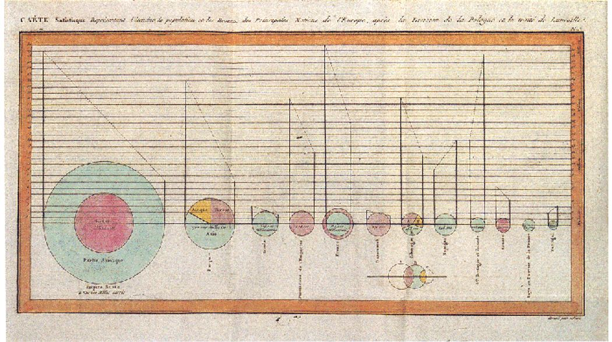

\cleardoublepage 

# Proportion--Pie charts and pareto plots{#Proportion}




From wikipedia: "The French engineer Charles Joseph Minard was one of the first to use pie charts in 1858, in particular in maps. Minard's map, 1858 used pie charts to represent the cattle sent from all around France for consumption in Paris (1858)."


Other examples of Minard's work: https://cartographia.wordpress.com/category/charles-joseph-minard/


## Pie and bar chart
Defense of pie charts: https://serialmentor.com/dataviz/visualizing-proportions.html#a-case-for-pie-charts
Good pie chart: Few elements, directly labled, alpha for pie pieces

Small multiple for pie vs stacked bar likert ratings or time trends


```{r, proportion-plot}
library(HistData)
library(tidyverse)
library(ggpubr)

night.df = Nightingale %>% 
  gather(key = cause, value = deaths, Disease:Other) %>%
  mutate(intervention = ordered( rep(c(rep('Before', 12), rep('After', 12)), 3), levels=c('Before', 'After'))) %>% 
  group_by(intervention, Month, cause) %>% 
  summarise(deaths = sum(deaths))

sum.night.df = night.df %>% group_by(cause) %>% summarise(deaths = sum(deaths))


# ## Statistic calculated internally
# ggplot(night.df, aes(cause, deaths)) + 
#   geom_bar(stat="summary", fun.y = "sum") 
# 
# ## Same plot but with seperately calculated summary
# ggplot(sum.night.df) + 
#   geom_bar(aes(reorder(cause, -cause.percent), cause.percent), stat = "identity") 
# 
# ## Horizontal bar
# ggplot(sum.night.df) + 
#   geom_bar(aes(reorder(cause, -cause.percent), cause.percent), stat = "identity") +
#   coord_flip() 


pie.plot = ggplot(sum.night.df, aes(x = factor(1), y = deaths, fill = cause)) +
  geom_bar(width = 1,  color="black", stat = "identity") + 
  coord_polar(theta="y") +
  fill_palette(palette = "grey") +
  labs(x = "", y = "")

stacked.plot =  ggplot(sum.night.df, aes(x = factor(1), y=deaths, fill = cause))+
   geom_bar(stat = "identity", position = "stack") +
   fill_palette(palette = "grey") +
   labs(x = "", y = "")
 
dodged.plot =  ggplot(sum.night.df, aes(x =cause, y=deaths, fill = cause))+
  geom_bar(stat = "identity", position = "dodge") +
   fill_palette(palette = "grey") +
   labs(x = "", y = "")

deaths.plot = ggarrange(pie.plot, stacked.plot, dodged.plot, 
                       nrow=1, ncol = 3, align = "hv", common.legend = TRUE)

deaths.plot
```

  
## Pareto plot: Whole part and and ranking
```{r, pareto-plot}
## Calculate percent and cumulative percent

sum.night.df = night.df %>% ungroup() %>%
  mutate(total.deaths = sum(deaths)) %>% group_by(cause) %>% 
  summarise(cause.percent = 100*sum(deaths)/max(total.deaths)) %>% ungroup() %>%
  arrange(-cause.percent) %>% 
  mutate(cum.cause.percent = cumsum(cause.percent)) 


## Pareto plot: Individual and cummulative proportion
ggplot(sum.night.df) + 
  geom_bar(aes(reorder(cause, -cause.percent), cause.percent), stat = "identity")+
  geom_point(aes(reorder(cause, -cause.percent), cum.cause.percent), colour = "red", size = 3)+
  geom_line(aes(reorder(cause, -cause.percent), cum.cause.percent, group = 1), colour = "red")

ggplot(data = sum.night.df) + 
  geom_hline(yintercept = 80) +
  geom_ribbon(aes(reorder(cause, -cause.percent), 
                  ymin = 0, ymax = cum.cause.percent, group = 1), fill = "darkgrey", alpha =.8) +
  geom_bar(aes(reorder(cause, -cause.percent), cause.percent), stat = "identity", width = .8) +
  geom_point(aes(reorder(cause, -cause.percent), cum.cause.percent), size = 3, colour = "red") +
  theme_bw()


# ## Pareto plot
# mtcars.df = mtcars
# sum.mtcars.df = mtcars.df %>% ungroup() %>%
#   mutate(total.n = n()) %>% group_by(gear) %>% 
#   summarise(gear.percent = 100*max(n())/max(total.n)) %>% ungroup() %>%
#   arrange(-gear.percent) %>% 
#   mutate(cum.gear.percent = cumsum(gear.percent)) 

# ggplot(data = sum.mtcars.df) + 
#   geom_hline(yintercept = 80) +
#   geom_ribbon(aes(reorder(gear, -gear.percent), 
#                   ymin = 0, ymax = cum.gear.percent, group = 1), fill = "darkgrey", alpha =.8) +
#   geom_bar(aes(reorder(gear, -gear.percent), gear.percent), stat = "identity", width = .8) +
#   geom_point(aes(reorder(gear, -gear.percent), cum.gear.percent), size = 3, colour = "red")

```


## Stacked bar chart
```{r, stacked-bar}

sum.night.df = night.df %>% ungroup() %>%
  mutate(total.deaths = sum(deaths)) %>% group_by(cause, intervention) %>% 
  summarise(cause.percent = 100*sum(deaths)/max(total.deaths),
            deaths = sum(deaths))

## Stacked bar with count: Shows data directly
ggplot(sum.night.df, aes(intervention, deaths, fill = cause)) +
	geom_bar(position = "stack", stat = "identity") +
   fill_palette(palette = "grey") +
   labs(x = "", y = "")

## Stacked bar with proportion: Abstracts to proportion
ggplot(sum.night.df, aes(intervention, cause.percent, fill = cause))+
	geom_bar(position = "fill", stat = "identity") +
   fill_palette(palette = "grey") +
   labs(x = "", y = "")

ggplot(sum.night.df, aes(intervention, cause.percent, fill = cause))+
	geom_bar(position = "dodge", stat = "identity") +
   fill_palette(palette = "grey") +
   labs(x = "", y = "")+
  theme_bw()

```

## Faceted Bar chart with overall reference distribution
The grey bars in the background represent the overall distribution and provide a referende for each of the marginal distributions.  

```{r, reference-bar}

diamonds.df = diamonds

count.diamonds.df = diamonds.df %>% group_by(cut, color) %>% summarise(count = n()) %>% 
  ungroup() %>% group_by(color) %>% mutate(color.count = sum(count))

ggplot(count.diamonds.df, aes(color, count)) +
  geom_bar(aes(color, color.count), stat = "identity", alpha =.33) +
  geom_bar(stat = "identity", alpha = .8) +
  facet_grid(cut~.)
```


## Rose or Coxcomb plots
Nightingale produced a graph "Diagram of the Causes of Mortality in the Army in the East"  that showed that most soldiers during the Crimean war died of disease rather than wounds. Improving hygiene in March of 1855 led to fewer disease related deaths.


This "Diagram of the causes of mortality in the army in the East" was published in Notes on Matters Affecting the Health, Efficiency, and Hospital Administration of the British Army and sent to Queen Victoria in 1858.


Coxcombe plot diminishes small values and requires square root transform

```{r, coxcombe, cache=TRUE}
ggplot(night.df, aes(x = Month, y = deaths, fill = cause)) +
  geom_bar(width = 1, position = "identity", color="black", stat = "identity") + 
  scale_y_log10() + 
  coord_polar(start=3*pi/2)  +
  facet_grid(.~intervention)  +
  fill_palette(palette = "grey") +
  labs(x = "", y = "") +
  theme_bw()

ggplot(night.df, aes(Month, deaths, fill = cause)) +
  geom_bar(stat = "identity") +
  facet_grid(intervention~.) +
   fill_palette(palette = "grey") +
   labs(x = "", y = "")+
  theme_bw()

```


## Stacked, dodged, and opposed bar chart
Comparison of many categories

* Stacked makes grouping easy

* Dodge makes comparison easy with common axis and relative judgment

* Opposing makes gender more apparent


```{r, stacked-dodged-opposed, message=FALSE, warning=FALSE}

## Diversity in Silicon Valley
diversity.df = read.csv("data/Reveal_EEO1_for_2016.csv")
diversity.df$count = as.numeric(diversity.df$count)

gender.diversity.df = diversity.df %>% filter(job_category=="Professionals", gender=="female"|gender=="male") %>% 
  group_by(company, gender) %>% summarise(count = sum(count)) %>% 
  group_by(company) %>% mutate(percent = 100*count/sum(count)) %>% 
  mutate(signed.gender = if_else(gender=="female", -count, count)) 

stacked.plot = ggplot(gender.diversity.df, aes(reorder(company, count), y=count, fill = gender))+
  geom_bar(stat = "identity") +
  labs(title = "Stacked",  x = "") +
  coord_flip()

dodged.plot = ggplot(gender.diversity.df, aes(reorder(company, count), y=count, fill = gender))+
  geom_bar(stat = "identity", position ="dodge") +
  labs(title = "Dodged", x = "") +
  coord_flip()

opposed.plot = ggplot(gender.diversity.df, aes(reorder(company, count), y=signed.gender, fill = gender))+
  geom_bar(stat = "identity") +
  geom_bar(stat = "identity") +
  scale_y_continuous(labels = abs) +
  labs(title = "Opposed", x = "", y = "count") +
  coord_flip()

gender.plot = ggarrange(stacked.plot, dodged.plot, opposed.plot, 
                       nrow=1, ncol = 3, align = "hv", common.legend = TRUE)
gender.plot

```


## Likert scale plot

```{r, likert-plot, cache=TRUE}

library(tidyr)
test<-data.frame(Q1=c(10,5,70,5,10),
                 Q2=c(20,20,20,20,20),
                 Q3=c(10,10,10,10,60),
                 Q4=c(35,15,0,15,35),
                 Q5=c(5,10,20,45,20))
test$category <- factor(c("VeryH", "H","Neutral", "L","VeryL"),
                        levels = c("VeryL", "L", "Neutral", "H", "VeryH"))

## Likert scale plots
test[3,1:5] = test[3,1:5]/2 # Divide by two to plot above and below zero

test.m <- gather(test, key = question, value = rating, -category)

ggplot(test.m, aes(x=question, fill=category)) +
  geom_bar(data = subset(test.m, category %in% c("VeryH","H", "Neutral")),
           aes(y = rating), position=position_stack(reverse = TRUE), stat="identity") +
  geom_bar(data = subset(test.m, category %in% c("VeryL","L", "Neutral")),
           aes(y = -rating), position=position_stack(reverse = FALSE), stat="identity") +
  geom_hline(yintercept = 0) +
  scale_fill_manual(breaks = c("VeryH", "H", "Neutral", "L","VeryL"),
                    values=c("darkgoldenrod2","lightblue", "grey90","darkgoldenrod4","lightblue4")) +
  labs(y = "Percent", x = "Question", fill = "") +
  ylim(-100,100) +
  theme_bw()

position = position_stack(reverse = TRUE)
```


## ternary (triangular) graph
Shows proportion of three variables that sum to 100 percent. Unfamiliar to most and so can be hard to interpret
ggtern


## Treemaps for whole-part of hierarchy
Schneiderman

```{r, treemap, cache=TRUE}
library(treemapify)


# Include websites
# ggplot(G20,
#        aes(area = gdp_mil_usd, fill = hdi,
#            label = country, subgroup = region)) +
#   geom_node_tile() +
#   geom_treemap_subgroup_border() +
#   geom_treemap_subgroup_text(place = "centre", grow = T, alpha = 0.5, colour =
#                              "black", fontface = "italic", min.size = 0) +
#   geom_treemap_text(colour = "white", place = "topleft", reflow = T)


```


## Circle packing
The most valuable graphical dimensions of x and y position are wasted in this plot becaue they have no meaning, but it can be engaging

```{r, circle-pack, warning=FALSE}

library(packcircles)
library(viridis)
library(tidyverse)
library(treemapify)

# Show with radius vs area 
packing = circleProgressiveLayout(G20$gdp_mil_usd, sizetype='area')
G20.df = cbind(G20, packing)
layout = G20.df %>% 
  dplyr::select(country, x, y, radius)

dat.pack <- circleLayoutVertices(layout, npoints=60, idcol = 1, xysizecols=2:4, sizetype = "radius")

dat.pack = left_join(dat.pack, G20.df, by = c("id" = "country"))
 
ggplot() + 
  geom_polygon(data = dat.pack, aes(x.x, y.x, group = id, fill=as.factor(gdp_mil_usd)), colour = "black", alpha = 0.6) +
  geom_text(data = G20.df, aes(x, y, size=gdp_mil_usd, label = country)) +
  scale_fill_manual(values = magma(nrow(G20.df))) +
  scale_size_continuous(range = c(1, 4)) +
  theme_void() + 
  theme(legend.position="none") +
  coord_equal()

```

