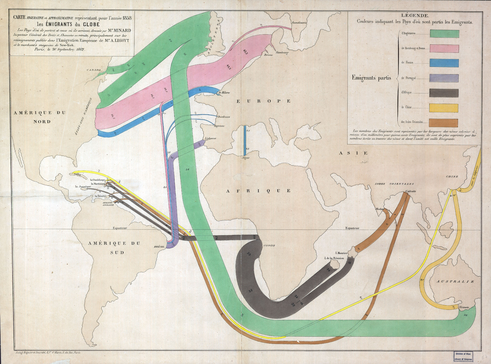

\cleardoublepage 

# Connection--maps and network plots {#Connection}

Test of examples


```{r, message=FALSE}
library(tidyverse)

```



## Maps
```{r, message=FALSE}
library(tidyverse)
library(ggalt)

```

### Choropleth
```{r, country-choropleth}
crimes.df <- data.frame(state = tolower(rownames(USArrests)), USArrests)

crimes.l.df <- gather(crimes.df, key = type, value = rate, -state)

states_map <- map_data("state")

ggplot() +
    geom_cartogram(data=states_map, aes(long, lat, map_id = region), map=states_map) +
    geom_cartogram(data=crimes.df, aes(fill = Murder, map_id = state), map=states_map) + 
    coord_map("polyconic")+
    labs(title = "ggalt: map coordinates")

ggplot() +
    geom_cartogram( data=states_map, aes(long, lat, map_id=region), map = states_map) +
    geom_cartogram(data=crimes.l.df, aes(fill = rate, map_id=state), map = states_map) +
    coord_map("polyconic") +
    facet_wrap( ~ type) +
    labs(title = "ggalt: map coordinates")
  
ggplot() +
    geom_cartogram( data=states_map, aes(long, lat, map_id=region), map = states_map) +
    geom_cartogram(data=crimes.l.df, aes(fill = rate, map_id=state), map = states_map) +
    coord_map("polyconic") +
    facet_wrap( ~ type) +
    labs(title = "ggalt: map coordinates") +
    theme_void()

```


### County map
```{r, county-map}
## devtools::install_github("hrbrmstr/ggalt", force=TRUE) # To install development version
## Examples from https://github.com/hrbrmstr/ggalt

# TODO replace with poverty or health outcomes data
library(tidyverse)
library(stringr)
library(viridis)


# From https://cran.r-project.org/web/packages/viridis/vignettes/intro-to-viridis.html

## Read and clean data
unemp.df = read_csv("http://datasets.flowingdata.com/unemployment09.csv")
save(unemp.df, file = "unemp")

load("unemp")

names(unemp.df) = c("id", "state_fips", "county_fips", "name", "year",
                  "--", "---", "---", "rate")
unemp.df$county = tolower(str_replace(unemp.df$name, " County, [A-Z]{2}", ""))

#unemp.df$county <- tolower(gsub(" County, [A-Z]{2}", "", unemp.df$name))
unemp.df$county = str_replace(unemp.df$county,"^(.*) parish, ..$","\\1")
unemp.df$state = str_replace(unemp.df$name, "^.*([A-Z]{2}).*$", "\\1")

## Use the maps package to convert maps data to a data frame
# "county" is a county map of the US
county.df <- map_data("county", projection = "albers", parameters = c(39, 45))

names(county.df) <- c("long", "lat", "group", "order", "state_name", "county")

state.df <- map_data("state", projection = "albers", parameters = c(39, 45))

## Replace state name with state abbreviations
county.df$state <- state.abb[match(county.df$state_name, tolower(state.name))]
county.df$state_name <- NULL

## Merge county and state shape information with unemployment data
choropleth.df <- merge(county.df, unemp.df, by = c("state", "county"))
#choropleth.df = county.df %>% inner_join(unemp.df, by = c("state", "county"))
  

choropleth.df = choropleth.df %>% dplyr::select(state:rate)
choropleth.df = choropleth.df %>% arrange(desc(order))

ggplot(choropleth.df, aes(long, lat, group = group)) +
  geom_polygon(aes(fill = rate), colour = alpha("white", 1/2), size = 0.05) +
  geom_polygon(data = state.df, colour = "grey90", fill = NA, size = 0.5) +
  coord_fixed() +
  theme_minimal() +
  ggtitle("US unemployment rate by county") +
  scale_fill_viridis(option="magma")+
  theme_void()

```

## US county small multiples


## World migration
TODO Add plot with migration data from kaggle


## Networks
https://www.data-imaginist.com/2017/ggraph-introduction-layouts/

### World migration network

Examples from: https://github.com/thomasp85/ggraph
```{r, warning=FALSE}
library(ggraph) # ggplot extension
library(igraph) # For network calculations


# Graph of highschool friendships
graph <- graph_from_data_frame(highschool)
V(graph)$Popularity <- degree(graph, mode = 'in')

# Network faceted by year
ggraph(graph, layout = 'kk') + 
    geom_edge_fan(aes(alpha = ..index..), show.legend = FALSE) + 
    geom_node_point(aes(size = Popularity)) + 
    facet_edges(~year) + 
    theme_graph(foreground = 'steelblue', fg_text_colour = 'white')
```

### Hierarchy
link to treemap

```{r}
## TODO Convert to migration data
graph <- graph_from_data_frame(flare$edges, vertices = flare$vertices)
set.seed(1)
ggraph(graph, 'circlepack', weight = 'size') + 
    geom_node_circle(aes(fill = depth), size = 0.25, n = 50) + 
    coord_fixed()+
    theme_graph()

## Data describe the class hiearchy of the Flare visualization library
ggraph(graph, layout = 'treemap', weight = 'size') + 
    geom_node_tile(aes(fill = depth))+
    theme_graph()


## Same basic data plotted as a circular tree
ggraph(graph, layout = 'dendrogram', circular = TRUE) + 
    geom_edge_diagonal() + 
    geom_node_point(aes(filter = leaf)) + 
    coord_fixed()+
    theme_graph()

```
