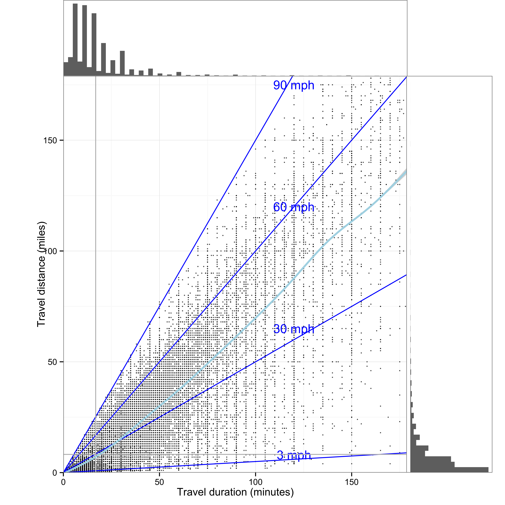
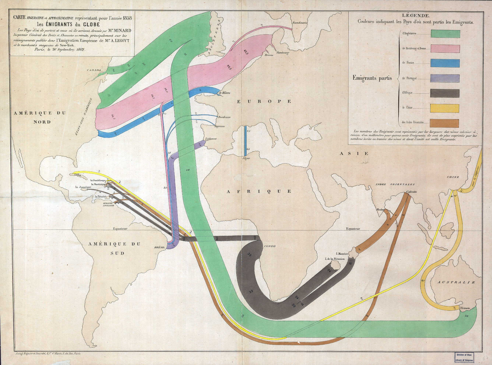

--- 
title: "Interactive data visualization"
author: "John D. Lee"
date: "`r Sys.Date()`"
output: pdf_document
cover-image: images/Minard_timeline_map.png
bibliography:
- vis
- book
- packages
description: A book of ggplot examples
documentclass: krantz
always_allow_html: yes
github-repo: jdlee/ggplot-examples
graphics: yes
link-citations: yes
lof: yes
lot: yes
colorlinks: yes
site: bookdown::bookdown_site
biblio-style: apalike
---

```{r setup, include=FALSE}
knitr::include_graphics('images/Minard_timeline_map.png', dpi = NA)
options(
  htmltools.dir.version = FALSE, formatR.indent = 2, width = 55, digits = 4
)

# install the packages needed by this book; you fill out c(), e.g. c('ggplot2', 'dplyr')
lapply(c("tidyverse", "lme4"), function(pkg) {
  if (system.file(package = pkg) == '') install.packages(pkg)
})
library(tidyverse)
library(ggpubr)
library(knitr)
library(svglite)
library(lme4)
library(ggforce)
library(ggthemes)
```

# Preface {-}


This book provides an introduction to ggplot2 for interactive data visualization. Its intent is to provide examples of common graphs and basic visualization principles. 

Minard's plot shows the deaths of almost 300,000 troups as they march to Moscow demonstrates the horror of war, and is considered one of the best visualizations ever producced [@Tufte1983]. Reasons why this graph is so effect is that it has a clear purpose, it answers important questions with a comples array of data that are presented in an understandable and aesthetically pleasing manner.


```{r minard, echo = FALSE, fig.cap = "Minards visualization of Napoleon's disastrous march to Moscow"}
include_graphics("images/Minard_timeline_map.png")
```


## Why read this book {-}

The aim of this book is help people make more graphs like Figure \@ref(fig:minard)). It links principles of graph design to examples that are implemented in R, particularly the popular graphic package ggplot2. The book provides a catalog of graphs and their design rationale organized around general questions that graphs are typically used to answer. 


## Structure of the book {-}

Chapter \@ref(Introduction) introduces R and the tidyverse functions and provides links for learning more about the basic capabilties of R. Chapters \@ref(Association) - \@ref(Connection) each describe different types of graphs that answer questions regarding association, distribution, comparison, proportion, fluctionation, and connection. Chapter \@ref(Tables) briefly considers graphical elements in tables and Chapters  \@ref(Polishing) - \@ref(Interaction) discuss interactive graphs and adjustments neeed for publication.

## Software information and conventions {-}

I used the **knitr**\index{knitr} package [@xie2015] and the **bookdown**\index{bookdown} package [@R-bookdown] to compile the book. Most graphs have been created with **ggplot2** [@{Wickham2016a] and data manipulation is done with *dplyr*.

<!--
```{r}
#My R session information is shown below:
# sessionInfo()
```
-->

## Acknowledgments {-}


```{block2, type='flushright', html.tag='p'}

```


<!--chapter:end:index.Rmd-->

# About the Author {-}

John D. Lee is a professor in the Department of Industrial and Systems Engineering at the University of Wisconsin-Madison. He has investigated the issues of human-automation interaction, particularly trust inautomation, for over 20 years. More specifically, his research considers trust and acceptance, as well as issues of distraction and engagement. He helped to edit the Handbook of Cognitive Engineering, which focusses on human interaction with increasingly autonomous systems. He is also a co-author of a popular textbook: Designing for People: An introduction to human factors engineering (http://designing4people.com).


<!--chapter:end:00-author.Rmd-->

\cleardoublepage 


```{r, echo=FALSE, message=FALSE}
library(knitr)
library(ggrepel)
library(tidyverse)
```

# Introduction: Audiences, purposes, questions {#Introduction}

Information technology has brought large volumes of data and the promise of a deeper understanding of a wide range of challenges from understanding the quarterly performance of a company to the effectiveness of a healthcare system or the health of an individual. Often this promise is not kept and data overwhelms rather than informs. Often a well-crafted visualization can address this problem and make data meaningful. This book provides principles and examples to make large volumes of data meaningful through visualization.

The book combines general visualization principles illustrated with examples.  It also includes the computer code so that each graph can be reporduced and used to plot other data. Nearly all the examples use ggplot2 which makes it relatively easy to replicate some of the classic visualization suggestions of E. Tufte, such as his minimalitic graph styles, as well as slope graphs (Section \@ref(tufte-slopegraph)) and small multiples (Section \@ref(tufte-smallmultiples)).

The book also includes ways of addressing common challenges with ggplot2, such as removing legend (Section \@ref(AddingRemovingLabels)) and reordering categories of column charts.


## Seeing meaning rather than numbers

Figure \@ref(fig:blood-tab) shows a typical report of a medical diagnostic test. The numerical summary shows the patient's values and the range of standard values. The information is there to show if a patient is dangerously outside the range, but a quick glance at the table might miss these indications. Even a careful reading of the table might miss warning signs, particularly if the critical information is in the trend that requires looking at a second table on another tab. Figure \@ref(fig:blood-vis) shows the data relative to the high and low normal range and makes deviations much more apparent. The ghosted points show past results and roughly indicate trends.


```{r blood-tab, echo = FALSE, fig.cap = "A typical report of a medical test makes finding deviations from the normal range difficult."}
knitr::include_graphics("images/Blood_table.jpg")
```


```{r blood-vis, fig.cap= "A visualization of the same results makes the deviations pop out.", , out.extra='', echo=FALSE}
#TODO move facet label to top left
blood.df = data.frame(measure = c("WBC (10*3/uL)", "Neutriphils (%)", 
                                  "Lymphocytes (%)", "Monocytes (%)",
                                  "Eosinophils (%)", "Basophils (%)",
                                  "RBC (10*6/uL)", "Hemoglobin (g/dL)",
                                  "Hemotocrit (g/dL)", "MCV (fL)",
                                  "MCH (pg)", "MCHC (g/dL)",
                                  "RDW", "Platelets (10*3/uL)"),
                      type = c("immune", "immune", "immune", "immune", "immune", "immune",
                               "redcells", "redcells", "redcells", 
                               "redcells",
                               "redcells", "redcells", "redcells", "redcells"),
                      order = c(1, 2, 3, 4, 5, 6, 7, 8, 9, 10, 11, 12, 13, 14),
                      value = c(5.62, 64.9, 
                                24.4, 9.3,
                                .9, .5,
                                4.1, 13.9,
                                39.4, 95.2,
                                33.6, 35,
                                13.2, 272),
                      lo = c(4, 42.2, 
                             20.5, 1.7,
                             0, 0,
                             4.7, 13.6,
                             42.0, 83,
                             26.0, 32,
                             11.5, 150),
                      hi = c(10.5, 75.2, 
                             51.1, 9.3,
                             6.0, 2.0,
                             6.0, 17.2,
                             52.0, 98.0,
                             33.0, 36,
                             14, 450)
                      )

s.blood.df = blood.df %>% mutate(s.value = (value-lo)/(hi-lo)) %>% 
  mutate(l1.s.value = (s.value-.5)/1.15 +.5) %>% # to show movement away from normal
  mutate(l2.s.value = (s.value-.5)/1.33 +.5) %>% # to show movement away from normal
  mutate(abnormal = ifelse(value<lo|value>=hi, TRUE, FALSE)) 


ggplot(s.blood.df, aes(reorder(measure, -order), s.value)) +
  geom_rect(xmin = -.5, xmax = 14.5,
            ymin = -.75, ymax = 0, 
            fill = "grey70", alpha = .05) +
  geom_rect(xmin = -.5, xmax = 14.5,
            ymin = 1.0, ymax = 1.75, 
            fill = "grey70", alpha = .05) +
  geom_text(aes(y = 0, label = lo), hjust = "inward", nudge_y = .005, alpha =.5, size = 3.3) +
  geom_text(aes(y = 1, label = hi), hjust = "inward", nudge_y = -.005, alpha =.5, size = 3.3) +
  #geom_line(aes(group = type), size = .33, alpha =.7) +
  geom_hline(yintercept = .5, linetype = "dashed", colour = "grey80")+
  geom_text(aes(label = value), nudge_x = .4) +
  geom_point(aes(y= l2.s.value, fill = abnormal), shape = 21, size = 1.5, alpha = .25) +
  geom_point(aes(y= l1.s.value, fill = abnormal), shape = 21, size = 2.5, alpha = .5) +
  geom_point(aes(fill = abnormal), shape = 21, size = 3.) +
  scale_fill_manual(values = c("white", "grey15"), guide = FALSE) +
  scale_y_continuous(breaks = NULL, limits = c(-.5, 1.5)) +
  coord_flip() +
  facet_grid(type~.,scales = "free_y")+
  labs(y = "", x = "") +
  theme_minimal(base_size = 10) +
  theme(strip.text = element_blank())

```


## Seeing more than summary statistics 
The easy availability of sophisticated machine learning and statistical models makes algorithmic interpretation of data tempting. However, such interpretations can mislead, with similar outcomes produced by very different underlying data.

Figure \@ref(fig:anscombe-vis) shows four distinct sets of data.  The differences are obvious when graphed.  One might expect that the typical summary statistics--mean, standard deviation, and correlation--would show equally stark differences.  Table \@ref(tab:anscombe-tab) shows this is not the case. Each data set has the same summary statistics.  

```{r anscombe-vis,  fig.cap = 'The Anscombe quartet and the limits of summary statistics.', echo = FALSE}

anscombe.df = anscombe %>% 
  gather(key = x, xvalue, x1:x4) %>% 
  gather(key = y, yvalue, y1:y4) %>% 
  mutate(x = substr(x, 2, 2), y = substr(y, 2, 2)) %>% 
  filter(y==x) %>% 
 # select(-x) %>% 
  rename(set = y)
  
anscombe.df$set = paste("Set", anscombe.df$set)

  
s.anscombe.df = anscombe.df %>% group_by(set) %>% 
  summarize(mean.y = mean(yvalue), sd.y = sd(yvalue), cor = cor(xvalue, yvalue))

ggplot(anscombe.df, aes(x = xvalue, y = yvalue)) + 
  geom_point() + 
  facet_wrap(~set) +
  labs(x = "", y = "")

```


```{r anscombe-tab, echo=FALSE}

kable(s.anscombe.df,  caption = 'Four seemingly identical datasets that illustrate the limits of algorithmic interpretation.',
      digits = 2, 
      col.names = c("Data set", "Mean", "Standard deviation", "Correlation"),
      booktabs = TRUE
      )

```

## Purposes and audiences of visualizations
What makes a "good" visualization depend on whether it is taylored to its purpose and its intended audience.  Generally graphs can serve three  general purposes--explore, inform, and engage [@Gelman2013]--and understanding what purpose the graph serves can help ensure the graph succedes. The purpose of the graph tends to depend on the audience, which can range from yourself, peers, scientists and engineers, managers, and the public. An extremely effective graph that you might use explore a dataset might fail to support peer in doing the same and might be completely inappropriate for presenting results to managers.  

Explore: the answer is unknown and audience is likely yourself and peers involved in the research.

Inform: the answer is known and the audience is likely a broader audience of scientists, engineers, or manager not direclty involved in the research.

Engage: the answer is known and must be communicated in an entertaining way to those who may might neet to be drawn into reading the graph and may not be familiar with conventions of scientific visualization, such as box plots.


## What question to answer?
Triadic perspective that links three distinct elements:
1. the person and their questions
2. the underlying data and its meaning
3. the graphical representation

This triadic perspective places equal emphasis on the analytics and processing of data and the visual representation that must be tailored to the motivation, needs and capacity of the people viewing the graph.

This requires:
1. Abstracting and aggregating (properties of the data) to address the intersts of the audience.11

2. matching types of graphs (visual representations) to types of questions (properties of the data)

3. matching types of graphs (visual representations) to the audience (properties of people, their interests, and experience)


  
## Storytelling with graphics

* High-level principles for communication, such as "Show don't tell"
* Role of annotation in going beyond the data: direct attention and explain, as in Table \@ref(tab:test).


Based on https://www.rdocumentation.org/packages/HistData/versions/0.8-4/topics/Minard

```{r, echo=FALSE, message=FALSE, warning=FALSE, cache=TRUE, fig.asp = 8.5/20.25}
library(HistData)
library(scales)
library(ggmap)
library(tidyverse)
library(gridExtra)
library(grid)
library(gtable)
#
# ## Match troop data to temperature data
# # Small difference in position require reconciliation
Minard.troops$survivors[Minard.troops$survivors==340000] = 422000 # Data don't match annotation on original plot
Minard.troop.temp = Minard.troops %>% filter(direction == "R") %>%
  filter(round(long, 0) %in% round(Minard.temp$long, 0)) %>%
  mutate(long = round(long, 0)) %>% distinct(long, .keep_all = TRUE)

Minard.temp = Minard.temp %>% mutate(long = round(long, 0))


## Create map
# campaign_map = get_map(
#   location = c(min(Minard.troops$long)-1, min(Minard.troops$lat)-.5,
#                max(Minard.troops$long)+1, max(Minard.troops$lat)+.75),
#   maptype = "toner-lines", source = "stamen")
# save(file = "minard_map", campaign_map)

load(file = "minard_map")


# ## Plot troop path
troop.plot = ggmap(campaign_map) +
  geom_path(data = Minard.troops,
            aes(long, lat, size = (survivors)^1.33, colour = direction, group = group),
            lineend = "round", linejoin = "bevel") +
  geom_text(data = Minard.cities,
            aes(long, lat, label = city), size = 2.75) +
  geom_segment(data = Minard.troop.temp,
            aes(x = long, xend = long, y = lat, yend = -Inf), alpha = .33) +
  coord_cartesian(xlim = c(23.5, 38.5)) +
  scale_size_continuous("Survivors", range = c(.25, 12)) +
  scale_color_manual("Direction", values = c("grey75", "grey35")) +
  labs(title = "Napoleon's March on Moscow") +
  theme_void() +
  theme(legend.position = "none",
    legend.box="horizontal",
    plot.margin = unit(c(0, 1.5, 0, 0), "cm"))

#
# ## Plot temperature vs. longitude, with labels for dates
temp.plot = ggplot(Minard.temp, aes(long, temp)) +
  geom_path(color = "grey75", size=1) +
  geom_point(size=1) +
  geom_segment(aes(x = long, xend = long, y = temp, yend = Inf), alpha = .33) +
  geom_text(aes(label=paste(temp, "°", " ", date, sep = "")), nudge_y = -4, size = 3) +
  labs(x= "", y = "Temp. (C°)") +
  scale_y_continuous(position = "right") +
  coord_cartesian(xlim = c(24.2, 38.15), ylim = c(-36, 5)) +
  theme_minimal() +
  theme(plot.margin = unit(c(0, .175, 0, 0), "cm"),
        axis.title.y = element_text(size = rel(.8)),
         panel.grid.minor = element_blank(),
        axis.text.x=element_blank(),
        axis.ticks.x=element_blank())

# ## Combine the plots
p1 = ggplot_gtable(ggplot_build(troop.plot))
p2 = ggplot_gtable(ggplot_build(temp.plot))

maxWidth = unit.pmax(p1$widths[2:3], p2$widths[2:3])
p1$widths[2:3] <- maxWidth
p2$widths[2:3] <- maxWidth

grid.arrange(p1, p2, heights = c(4, 1.5))

# library(cowplot)
# plot_grid(troop.plot, temp.plot,
#           nrow = 2,
#           rel_heights = c(4, 1.5), axis = "l")
# library(ggpubr)
# ggarrange(troop.plot, temp.plot,
#           nrow = 2,
#           heights = c(4, 1.5), align = "v")
```


## Data sources
This book uses data from the following sources:

Work and life activity:
American Time Use Survey (ATUS) 
https://www.bls.gov/tus/
https://cran.r-project.org/web/packages/atus/atus.pdf

O*NET occupational information: knowledge, skills, abilties, task composition
https://www.onetonline.org


Accident data: Occupational injury, motor vehicle crashes
Babynames
Sleep data
Healthcare:
Taste: Wine, chocolate


https://www.kaggle.com

https://www.data.gov Consumer complaint database, NTSB accident database

https://flowingdata.com/category/projects/data-underload/

http://www.wolframalpha.com

R packages: HistData, babynames


Yao about data and web scraping and the package 

```{r, happiness-plot, cache=TRUE}

## Read data from website
# sports <- read_tsv("https://github.com/halhen/viz-pub/raw/master/sports-time-of-day/activity.tsv")


## Happiness

happiness.df = read.csv("data/world-happiness-report/2017.csv")

highlight.df = happiness.df %>% filter(
  Economy..GDP.per.Capita.>1.75|
  Happiness.Score>7.4|
  (Happiness.Score>5&Economy..GDP.per.Capita.<.5)|
  (Happiness.Score>6&Economy..GDP.per.Capita.<1)|
    Country=="United States")

ggplot(happiness.df, aes(Economy..GDP.per.Capita., Happiness.Score)) + 
  geom_point(colour = "grey25") +
  geom_point(data = highlight.df, color = "orange")+
  geom_text_repel(data = highlight.df, aes(label = Country))+
  labs(title = "Money doesn't buy happiness, but it helps", 
       subtitle = "Source: https://www.kaggle.com/unsdsn/world-happiness 2017",
       y = "Happiness", x = "Per capita GDP")

## Chocolate
# chocolate.df = read.csv("flavors_of_cacao.csv")
# chocolate.df$Cocoa.Percent = as.numeric(chocolate.df$Cocoa.Percent)
# ggplot(chocolate.df, aes(Cocoa.Percent, Rating)) + geom_point()


## Police
## 2535 observations, Age, gender, how armed, state, threat, body cameraAll factors
 police.df = read.csv("data/PoliceKillingsUS.csv") 

# Canadian vehicle specifications: http://www.carsp.ca/research/resources/safety-sources/canadian-vehicle-specifications/
```


## Grammar of data manipulation
This book is not about data reduction and data wrangling. The tidyverse provides an intrgrated set of tools for data wrangling http://r4ds.had.co.nz.  

Filter, select, mutate summarise


## Grammar of graphics
Data, layers of geometric eleements, map and set aesthetic properties of each layer of geometric element locally or globally
Simple example


## Considering cognitive capabilities in graphic design
Capitalizing on power of visual perception
Same graph with out without consideration

<!--chapter:end:01-introduction.Rmd-->

\cleardoublepage 

# Visualization types and principles {#Principles}
Questions guide choice of general graph types
Cognitive operations needed to answer questions guide the choice of graphical details
The path of attention associated with a sequence of cognitive operations needed to form a coherent story guides the choice of layout and interactive elements 

Four general aspects of visual perception and cognition govern how well people interpret graphs: 

1. Guidance and span of the attentional spotlight
2. Sensitivity to grouping and patterns
3. Discrimination and judgement of values
4. Sensitivity to navigation cohence and narative structure 


```{r graphtypes, echo=FALSE, message=FALSE, cache=TRUE}

#### Icons of graph type for common comparisons

library(ggdendro)
library(tidyverse)
library(ggpubr)
library(knitr)
library(latticeExtra) # For 3-D bar graph
set.seed(66)

## Set default and create data
theme_set(
  theme_bw() + 
    theme(
      axis.text.x = element_blank(),
      axis.text.y = element_blank(),
      axis.ticks = element_blank(),
      axis.title.x = element_blank(),
      axis.title.y = element_blank(),
      panel.grid.major.x=element_blank(),
      panel.grid.major.y=element_blank(),
      panel.grid.minor.x=element_blank(),
      panel.grid.minor.y=element_blank(),
      plot.margin=unit(c(.1,.1,.1,0), "cm"),
     # panel.border = element_rect(fill = NA, colour = "black", size = 2),
      legend.position = "none",
      aspect.ratio = 1
      )
)

## Create data
x = rnorm(15)
y = 2*x+rnorm(15)+.5
data.df = data.frame(x, y)


#### Association: Scatterplot ####
scatter_plot = ggplot(data.df, aes(x, y)) + geom_point(size = .75) +
  geom_smooth(method= "lm", size = 1., colour= "black") 


#### Fluctuation: Timeline ####
timeline_plot = ggplot(data.df, aes(x, y))+geom_line(size=1)


#### Distribution: Dotplot, Histogram, Density, Model Density ####
dot.plot = ggplot(data.df, aes(x)) + geom_dotplot(binwidth = .5)
dot_85th.plot = ggplot(data.df, aes(x)) + geom_dotplot(aes(fill = x<.85), binwidth = .5) +
  scale_fill_manual(values = c("red", "grey20"), guide= FALSE) 

histogram_plot = ggplot(data.df, aes(x)) + geom_histogram(binwidth = .4) 

density.plot = ggplot(data.df, aes(x)) + geom_density(fill = "darkgrey") 

density_norm.plot = ggplot(data.df, aes(x)) + geom_density(fill = "darkgrey") +
                stat_function(fun = dnorm, args = list(mean = .3, sd = 1), colour = "black", size = 2.5)


#### Proportion: Stacked bar ####
x = rnorm(15)
y = 1.5*x+rnorm(15)+.5
data.df = data.frame(x, y)

l.data.df = gather(data = data.df, key = condition, value = size)
sum.l.data.df = l.data.df %>% mutate(d.measure = cut(size, breaks = 2, labels = c("Low", "High")))

stacked_bar_plot = ggplot(sum.l.data.df, aes(condition, fill = d.measure)) + geom_bar() +
  scale_fill_manual(values = c("grey", "grey15"))


#### Comparison: Boxplot ####
l.data.df = gather(data = data.df, key = condition, value = size)

box_plot = ggplot(l.data.df, aes(condition, size))+
  geom_boxplot(fill="grey15", size= 1., color = "grey15")+
  stat_summary(geom = "crossbar", width=0.9, fatten=2.5, color="white", 
               fun.data = function(x){ return(c(y=median(x), ymin=median(x), ymax=median(x)))})


#### Contribution: pareto plot  ####


# implementing the function:
ggpareto <- function(x) {
    library(dplyr)
  title <- deparse(substitute(x))
  x <- data.frame(modality = na.omit(x))
  
  Df <- x %>% group_by(modality) %>% summarise(frequency=n()) %>% 
    arrange(desc(frequency))
  
  Df$modality <- ordered(Df$modality, levels = unlist(Df$modality, use.names = F))
  
  Df <- Df %>% mutate(modality_int = as.integer(modality), 
                      cumfreq = cumsum(frequency), cumperc = cumfreq/nrow(x) * 100)
  nr <- nrow(Df)
  N <- sum(Df$frequency)
  
  Df_ticks <- data.frame(xtick0 = rep(nr +.55, 11), xtick1 = rep(nr +.59, 11), 
                         ytick = seq(0, N, N/10))
  
  y2 <- c("  0%", " 10%", " 20%", " 30%", " 40%", " 50%", " 60%", " 70%", " 80%", " 90%", "100%")
  
  library(ggplot2)
  
  g <- ggplot(Df, aes(x=modality, y=frequency)) + 
    geom_bar(stat="identity", aes(fill = modality_int)) +
    geom_line(aes(x=modality_int, y = cumfreq, color = modality_int)) +
    geom_point(aes(x=modality_int, y = cumfreq, color = modality_int), pch = 19) +
    scale_y_continuous(breaks=seq(0, N, N/10), limits=c(-.02 * N, N * 1.02)) + 
    scale_x_discrete(breaks = Df$modality) +
    guides(fill = FALSE, color = FALSE) +
    scale_fill_continuous(low="grey10", high="grey90")+
    scale_colour_continuous(low="grey10", high="grey90")
    #scale_fill_grey()
    #scale_colour_grey()#+scale_fill_grey()
    #annotate("rect", xmin = nr + .55, xmax = nr + 1, 
     #        ymin = -.02 * N, ymax = N * 1.02, fill = "white") +
   # annotate("text", x = nr + .8, y = seq(0, N, N/10), label = y2, size = 3.5) +
   # geom_segment(x = nr + .55, xend = nr + .55, y = -.02 * N, yend = N * 1.02, color = "grey50") +
   # geom_segment(data = Df_ticks, aes(x = xtick0, y = ytick, xend = xtick1, yend = ytick)) 
    #labs(title = paste0("Pareto Chart of ", title), y = "absolute frequency") +
    #theme_bw()
  
  return(list(graph = g, Df = Df[, c(3, 1, 2, 4, 5)]))
}

# applying the function to the factor variable:
# creating a factor variable:
Example <- rep(c(letters[1:2], LETTERS[1:3]), c(15, 39, 6, 42, 50))

pareto_plot = ggpareto(Example)


#### Connection: Network diagram ####
library(igraph)
library(reshape2)
gggraph <- function(g, vplace = rnorm) {
  require(ggplot2)
  g_ <- get.edgelist(g)
  g_df <- as.data.frame(g_)
  g_df$id <- 1:length(g_df[,1])
  g_df <- melt(g_df, id=3)
  xy_s <- data.frame(value = unique(g_df$value), 
                     x = vplace(length(unique(g_df$value))), 
                     y = vplace(length(unique(g_df$value))))
  g_df2 <- merge(g_df, xy_s, by = "value") 
  
  p <- ggplot(g_df2, aes(x, y)) +
    geom_point(size=1.5) +
    geom_line(size = .75, aes(group = id)) + #, linetype = factor(id)
    #geom_text(size = 4, hjust = 1.5, aes(label = value)) +
    theme_bw() + 
    theme(panel.grid.major=element_blank(), 
         panel.grid.minor=element_blank(), 
         axis.text.x=element_blank(),
         axis.text.y=element_blank(),
         axis.title.x=element_blank(),
         axis.title.y=element_blank(),
         axis.ticks=element_blank(),
        # panel.border = element_rect(fill = NA, colour = "black", size = 2),
         legend.position="none")
  p
}

g <- erdos.renyi.game(20, 12, type="gnm")
network_plot = gggraph(g, rnorm)


#### Hiearchy: dendrogram  ####
model <- hclust(dist(USArrests), "ave")
dhc <- as.dendrogram(model)

ddata <- dendro_data(dhc, type = "triangle")

dendro_plot = ggplot(segment(ddata)) + 
  geom_segment(aes(x = x, y = y, xend = xend, yend = yend))  
  #coord_flip() + 
  #scale_y_reverse(expand = c(0.2, 0)) +
  #theme_dendro()


#### Combined plots ####
type.plot = ggarrange(scatter_plot, histogram_plot, box_plot, 
                      stacked_bar_plot, timeline_plot, network_plot,
                      labels = c("Association", "Distribution", "Comparison",
                                 "Proportion", "Fluctuation", "Connection"),
                      nrow=2, ncol = 3, align = "hv")
type.plot

theme_set(theme_grey())
```


## Pairing questions and graph types


Graphs answer questions about data by showing relationships and making comparisons easier. Before creating a graph it is critical to specify the questions and comparisons of interest. Figure \@ref(fig:graphtypes) shows common graphs and general questions they might answer. For example, in the upper left is a graph that shows the association between variables. This type of graph answers questions such as "how does X influence Y?", as in "does increasing the prices of gas reduce the amount of driving?". A scatter plot shows the strength and nature of this association. Each graph in Figure \@ref(fig:graphtypes) is suited to a different question:


Graphs answer questions about data by showing relationships and making comparisons easier. Before creating a graph it is critical to specify the questions and comparisons of interest. Table \ref{tab:GraphTypes} shows common graphs and general questions they might answer. For example, in the upper left is a graph that shows the association between variables. This type of graph answers questions such as how does X influence Y, as in ``does increasing the prices of gas reduce the amount of driving?''. A scatter plot  shows the strength and nature of this association.  


* Association: What influences an outcome?
* Distribution: What is the spread of the observations?
* Comparision: How does one condition differ from another?
* Proportion: What is the size of the components that make up the whole?
* Fluctuation: How does the do observations vary over time?
* Connection: How are the observations connnected over a map or network?

Combinations of questions, such as changes in distribution or proportion over time 


Questions in terms of patterns vs precision

Graph type and familiarity, pie charts
Scatter plot to 2-density, comparison to ranking, dotplot to violin or boxplot.


Graph types and volume of data.  
More data requires abstraction. Some plots scale well others do not, overplotting one example of scaling challenges with increasingly large data.


More data points and more variables (e.g., time sequences, categories), organize chapters to move from few points and few variables to many (e.g., histogram to small multiple, to heatmap)

Types of data sets:
Number of observations (independent, sequential)
Number variables (nominal, ordinal, interval)

~50 observations and 5 nominal and 7 interval variables (mtcars, IIHS vehicle fatalities)
~50 observations and 1 nominal and 4 interval variables (iris)
~200 observations and 2 nominal and interval variables (10) (belts)
~50,000 observations an 10 nominal and interval variables (diamonds)


The examples for each type of graphs represent one of many possible representations. For example, the stacked bar chart addresses questions of proportion, but so can pie charts and 3-D pie charts. How do you choose between these alternatives? One consideration is to select display dimensions that make it easy for people to make comparisons needed to answer the questions---identify effective mapping between data and display dimensions---which we turn to in the following section.

  
## Percpetual processes to be supported: Comparison, Detection, Pattern identification

Attentional span 
Visual WM limits
Preattentive cues
Compatability 
Conventions and familiarity


### Read and judge values
Differences between conditions, Compare to zero?
Perceptual sensitivity
Proximity compatibility principle (enable relative rather than absolute comparisons with reference lines and data ordering)

```{r}
cyl_mtcars.df = mtcars %>% mutate(cyl = as.factor(cyl)) %>% 
  group_by(cyl) %>% 
  summarise(m.mpg = mean(mpg))

ggplot(cyl_mtcars.df, aes(cyl, m.mpg)) +
  geom_col(fill = "grey70") +
  geom_text(aes(label = round(m.mpg, 1)), vjust = 1.5)
  
```

### Compare values


### Detect and select
Outliers, deviations from assumptions
Popout effects 
TODO Create figure to show cost of conjunctive search and benefit of redundant coding


```{r, scatterplot-popout, echo=FALSE, echo=FALSE}
happiness.df = read.csv("data/world-happiness-report/2017.csv")

serial.plot = ggplot(happiness.df, aes(Freedom, Happiness.Score)) + 
  geom_point(alpha=.75) +
  geom_point(data = happiness.df %>% filter(Country == "Mexico"), shape = 15, size = 2)+
  theme_bw()

popout.plot = ggplot(happiness.df, aes(Freedom, Happiness.Score)) + 
  geom_point(alpha=.75, shape = 21) +
  geom_point(data = happiness.df %>% filter(Country == "Mexico"), colour = "blue", size = 3)+
  theme_bw()


ggarrange(serial.plot, popout.plot, 
          labels = c("Serial", "Parallel"),
          nrow=1, ncol = 2, align = "hv")

```


### Identify groups and patterns
Associations, interactions, and changes over time
Gestalt principles 

Preattentive processing

TODO Create figure to show relative benefit of shape, intensity color for grouping 

Grouping and gestalt
  Similarity
  Continuity
  Connection
  Proximity
  Enclosure
  Closure
  

TODO Figure ground showing data and summary vs summary and data


### Narrative structure and sequence


Storytelling and visual momentum

## Principles from general to specific
[@Tufte1983], [@Munzner2014, @Gelman2013a] 

ten guidelines [@Kelleher2011a]


Guidelines for HF publications [@Gillan1998]


Comprehensive book on visualization [@Ware2013]


Effort to separate and effort to integrate--focussed and selective attention


### Identify audience, story, and key relationships (Few)

### Focus attention and organize reading
  Group
  Prioritize
  Provide context
  Sequence
  
Be consistent, every difference should tell


### Annotate to show cause and explain why

### Concrete details engage and are memorable
Connect to the world


### Enable comparisons and put data in context 
(Tufte)
  Scatter plot: Data points with linear and loess models 
  Category plot: Boxplot with individual data points
  Time series: Small multiples with grand mean 

Estimation errors and effort proportional to the absolute difference from common baseline: reference lines provide a local baseline. TODO Show tall bars with mean reference line


### Map types of variables to graph features
Mapping data to graph features [@Cleveland1985]

For the purposes of display design, three different data types guide the choice of display dimensions: interval, ordinal, and nominal [@Cleveland1985]. Interval data include real or integer numbers (e.g., height and weight), ordinal data are categories that have a meaningful order (e.g., compact, mid-size, and full-size cars), and nominal data are categories that have no order (e.g., male, female). Each data type can be represented with one of several graph dimensions, such as color or position, but certain mapping support more accurate judgments.  

Size of circle: map to radius or the area 
TODO create plot to show map to radius and area

TODO show good and bad mappings

color  [@Silva2011]


```{r, perceptual-sensitivity, fig.cap = "Aesthetic mapping."}
data = read.csv('data/DataAestheticMapping.csv')

data$Type = factor(data$Type, levels=c("Interval", "Ordinal", "Nominal"))

ggplot(data, aes(Type, reorder(Rank, -Rank), group = Aesthetic)) +
  geom_line(alpha = .4, size = 2.5) +
  geom_text(aes(label = Aesthetic), size = 5) +
  ylab("Rank") + xlab("Data type") +
  theme_bw()
```

%TODO figure for mapping types of data and graph dimensions  [@Cleveland1985]

Figure XX shows seven ways to code these data  [@Cleveland1985]. For all three types of data,  position, such as the horizontal or vertical placement of a point in a graph, support the most precise judgments. The other ways of coding information depend on the type of data: hue is a poor choice for interval data, but a good choice for nominal data, as is shape. Because shape and color have no natural mapping to magnitude, they are a poor choice for interval and ordinal data. Magnitude is best represented by position on a common scale, followed by position on an unaligned scale, length and then angle, followed by size [@Munzner2014, @Cleveland1985].  Because size and angles are relatively hard to judge, pie charts are not a good way to represent proportions.

Limits of absolute judgment underlie the effectiveness of coding data with various display dimensions. Coding nominal data with more than seven hues will exceed people's ability and so they would not be able to reliably link lines on a graph to categories. Data presented on aligned scales, such as the bottom category in a stacked bar chart, can be judged very precisely, but the limits of absolute judgment make interpreting the upper categories more difficult. This means that the bottom category of a stacked bar chart should be chosen carefully. Generally, avoid placing data on unaligned scales. Instead, support relative judgments based on a common scale.  The circular format of pie charts means that there are no aligned scales and  is another reason why they  are not  as effective as stacked bar charts. 

Because visualization involves multiple conceptual dimensions, a natural choice is to use three-dimensional Euclidian space. However, three-dimensional figures make accurate comparisons difficult due the ambiguity of rendering three dimensions on a two dimensional plane. Of all the ways to represent a quantity, the volume of a three-dimensional object leads to the most inaccurate judgments [@Munzner2014]. 

Another important conceptual dimension is time. Time, like space, is compatibly mapped to display dimension of position, often advancing from left (past) to right (future). Time can also be directly mapped to display time via animation. Animated graphs can be compelling, but they require working memory to track objects across the display and so severely limit the number of data points that can be compared. Interactive visualization described in Chapter 10 can give control with a slider and avoids this limit to some degree.


### Ensure proximity compatibility
Proximity compatibility and legend: link to line, orientate to match orientation in graph, sequence to match sequence in graph

Visual attention must sometimes do a lot of work, traveling from place to place on the graph, and this effort can hinder graph interpretation. Hence, it is important to construct graphs so things that need to be compared (or integrated) are either close together in space or can be easily linked perceptually by a common visual code. This, of course, is a feature for the proximity compatibility principle (A3) and can apply to keeping legends close to the lines that they identify, rather than in remote captions or boxes. Similarly, when the slopes and intercepts of two lines need to be compared, keep them on the same panel of a graph rather than on separate panels. The problems of low proximity will be magnified as the graphs contain more information---more lines. Similarly, in a box plot  with many categories people will be able to compare categories that are close to each other more precisely than those that are separated.  You should order categories so that those to be compared are closest.

Proximity goes beyond physical distance. A line linking points on a timeline can enhance proximity as can color and shape. Lines and color can be effective ways of  making groups of points in a network diagram  ``closer'', and easier to interpret as a group.  Objects with identical colors tend to be associated together, even when they are spatially separated. Furthermore a unique color tends to stand out.  It is also the case that space is compatibly mapped to space, so that visualization of geographic areas is best accomplished when the dimensions of rendered space correspond to the dimensions of displayed space--a map.


As with its application to other display designs, the  proximity compatibility principle means that the visual proximity of elements of the graph need to correspond to the mental proximity needed to interpret this information.  For graphs, this means the questions and comparisons the graph is intended to address should specify  what is ``close'' in the graph.


### Legibility and consistency
As with other types of displays, issues of legibility are again relevant. However, in addition to making lines and labels large enough to be readable, a second critical point relates to discriminability (P9). Too often, lines that have very different meanings are distinguished only by points that are highly confusable, as in the graph on the left of Figure XX. Here incorporating redundant coding of differences can be quite helpful. In modern graphics packages, color is often used to discriminate lines, but it is essential to use color coding redundantly with another salient cue. Why? As we noted in Chapter 4, not all viewers have good color vision, and a non-redundant colored graph printed from a black and white printer or photocopied may be useless.


### Maximize data/ink ratio 
(Tufte)
* Maximize data to create rich representation, minimize extraneous non-data elements

* Minimize non-data elements: bar charts rather than 3-D pie

Annotate to integrate interpretation and data

Simplify to amplify content

Simplify content to amplify point


### Manage clutter with grouping and layering 
* Match data type to appropriate aesthetics (Cleveland)
  Only position good for all data types: Focus on 2d-plane and relative judgments
  Consider data type: size better than color for interval data


Graphs can easily become cluttered by presenting more lines and marks than the actual information they convey. As we know,  clutter can be counterproductive , and this has led some to argue that the data-ink ratio should always be maximized [@Tufte1983]; that is, the greatest amount of data should be presented with the smallest amount of ink. While adhering to this guideline is a valuable safeguard against the excessive ink of "chart junk" graphs, such as those that unnecessarily put a 2-D graph into 3-D perspective, the guideline of minimizing ink can however be counterproductive if carried too far. Thus, for example, the ``minimalist'' graph in center of Figure X, which maximizes data-ink ratio, gains little by its decluttering and loses a lot in its representation of the trend, compared to the line graph on the right Figure XX. The line graph contains an emergent feature---slope---which is not visible in the dot graph. The latter is also much more vulnerable to the conditions of poor viewing (or the misinterpretation caused by the dead bug on the page!).


%Figure 21. Space shuttle launches, temperature and O-ring damage.
%TODO I love the example, but A more elaborated caption is needed to direct reader’s attention to the problem.

In some cases, the poor data to ink ratio and prevalence of chart junk might create engaging graphics, other times it can be annoying, but in presenting engineering data it can undermine the quality of life and death decisions. Figure 20 shows the graphic used to support the launch decision associated with the disastrous flight of the Space Shuttle Challenger the data presented in this way makes it difficult to assess the effect of temperature on O-ring damage, which may have encouraged the managers to launch in cold weather [@Tufte1997].

Figure X shows that you can increase the data-to-ink ratio by reducing the ``ink'' devoted to non-data elements.  Another way to increase the data-to-ink ratio is to include more data.  More data can take the form of reference lines and multiple small graphs, as in Figure XX.  More data can also take the form of directly plotting the raw data rather than summary data. 

Figure \@ref(fig:trip-dur) shows an extreme version, in which each data point represents one of approximately 693,000 trips reported in the 2009 travel survey XXcite FHWA2011. The horizontal axis indicates the duration and the vertical axis shows distance of each trip. The diagonal lines of constant speed place these data in context by showing very slow trips---those under the 3mph line---and very fast trips---those over the 90mph line. Histograms at the top and side show the distribution of trip duration and distance. The faint vertical and horizontal lines show the mean duration and distance. Like other visualizations that include the raw data, this visualization shows what is behind the summary statistics, such as mean  trip distance and duration.

Showing the underlying data has the benefit of providing a more complete representation, but it can also overwhelm people. Data can create clutter.  One way to minimize clutter is by grouping and layering  the data.  In the case of  Figure \@ref(fig:trip-dur) this means making the individual data points small and faint.


```{r trip-dur, fig.cap="An example of extreme data-to-ink with over 693,000 data points", echo = FALSE}

```

## Overview of examples
Simple, few variables, few observations and single graphical element to and complex, many observations to combitions of graphical elements

<!--chapter:end:02-principles.Rmd-->

\cleardoublepage 

# Association--scatterplots{#Association}

## Basic elements of the grammar of graphics

Table:(\#tab:test) Summary of ggplot element.

ggplot element     Description
-------------      ---------
Data	             ggplot uses a dataframe as input (e.g., data = mtcars.data)
Geoms		           geometric element (e.g., geom_point, geom_bar)
Mapping	           links data variables to aesthetic dimensions (aes)	(e.g., aes(x = cyl, y = mpg))
Setting		         specifies value of aesthetic dimension directly	(e.g., colour = “blue”)
Layers	           add components to base plot, most often	geoms (additional layers added with  “+”)
Stats		           statistical summary, such as density or count; each geom has a default statistic
Position	         adjusts the location of the plotted geom
Annotations        text and graphical overlays 
Coordinate system  Cartesian, polar or small multiple facets
Themes	           sets of plot parameters (e.g., font, background)


## Simple scatterplot 
The simplest plot must include data, aesthetic mapping, and geom a geometric element. The data must be organized with each observation as a row and each variable as a column. For a scatterplot the geometric element is a point, and the aesthetic mapping links variables to properties of the geometric element. For a scatterplot this would be the x and y position of the point. the the point the x and y position must be specified, but other properties, such as color, size, alpha level, and shape, can be mapped to variables. These properties of the geometric element can also be set to specific values, such as specifying the color of the point.

Figure \@ref(fig:simple-scatterplot) shows the ggplot2 code and associated scatterplot. The equation used to specify the plot implicitly specifies the values by their position, such as data being identifed as following "ggplot(".  The following speciifcations are equivalent:


```{r, simple-scatterplot, message=FALSE, cache=TRUE}

library(tidyverse)

mtcars.df = mtcars

ggplot(data = mtcars.df, mapping = aes(x = wt, y = mpg)) +
  geom_point(colour = "darkblue")

```

A powerful feature of ggplot2 is the abilty to add layers of geometric elements to a plot. Each layer can have its own data, mapping of aesthetic properties, and setting of aesthetic properties. The data and mapping specified in the base plot statement--"ggplot(data = mtcars.df, mapping = aes(x = wt, y = mpg))"--are global and apply to all layers, but can overridden by the any mappings specific to a layer. 

Figure \@ref(fig:scatterplot-layering) shows a layer of red circles based on a subset of the data.


```{r, scatterplot-layering, cache=TRUE}

fourcyl.mtcars.df = mtcars.df %>% filter(cyl==4)

ggplot(data = mtcars.df, mapping = aes(x = wt, y = mpg)) +
  geom_point(colour = "darkblue") + 
  geom_point(data = fourcyl.mtcars.df, colour = "red", shape = 21, size = 4)
  
  
```


## Scatterplot with additional mappings
The scatterplot typically maps variables to the x and y position of the points, but ggplot allows for other mappings.  Figure \@ref(fig:scatterplot-mapping) shows mapping variables to the fill and size of the points. The shape, stroke, and color of the points are set to values they could also be mapped, which could quickly overload the graph. Note that only shapes 21-25 in Figure \@ref(fig:symbols) can include fill and stroke, with the other symbols color determines the color of the whole symbol not just the border.

```{r, scatterplot-mapping, cache=TRUE}

ggplot(data = mtcars, mapping = aes(x = wt, y = mpg, fill = hp, size = 1/qsec)) + 
  geom_point(shape = 21, colour = "darkred", stroke = 2.) 
```


```{r, symbols, echo=FALSE, cache=TRUE}
library(ggpubr)

symbol.plot = ggplot(data = data.frame(x = c(0: 25)), aes(x = x, y = x, shape = x)) + 
  geom_point(size = 6) +
  scale_shape_identity() +
  facet_wrap(~ x, scales = 'free') + 
  theme_void()

line.plot = ggplot(data=data.frame(x=c(1:6))) + 
  geom_hline(size=2, aes(yintercept=x, linetype=x)) +
  scale_linetype_identity() +
  xlim(c(0, 50)) +
  facet_wrap(~ x, ncol = 2, scales = 'free')+
  theme_void()

ggarrange(symbol.plot, line.plot, 
nrow=1, ncol = 2)

```


```{r, colors}
library(RColorBrewer)

display.brewer.all(type="qual")
 
display.brewer.all(type="seq")

display.brewer.all(type="div")

# display.brewer.all(n=NULL, type="all", 
#                    select=NULL, exact.n=TRUE, 
#                    colorblindFriendly=FALSE)

```


## Scatterplot with linear and loess fit
The layers can include geometric elements beyond geom_point. Perhapts the most useful geoms to add to a scatterplot is a curve fit. Figure \@ref(fig:scatterplot-smooth) shows a simple scatterplot with two cruve fits.  The loess fit shows a smooth fit that indicates non-linar trends, and the blue line shows a linear regeression. The loess line highligths areas in the data that deviate from a linear relationship shown by the blue line. All three layers inherit the same x and y mapping from the ggplot base layer. 

When building a plot each layer is placed on top of the preceding layer, such that the last layer lies on top of all the others.  With Figure \@ref(fig:scatterplot-smooth), the points are on the bottom and the light blue line is on top of the gray loess line.

Table \@ref(tab:geoms) shows the full set of possible geometric elements that can be used to create graphs, the following chapters describe many of these.

Note  the smooth fit geoms include additional settings for the method and whether the line should include a standard error.

```{r, scatterplot-smooth}

ggplot(data = mtcars.df, aes(x = wt, y = mpg)) +
  geom_point(colour = "darkblue") +
  geom_smooth(method = "loess", se = FALSE, colour = "darkgrey") + 
  geom_smooth(method = "lm", fill = "lightblue")

```

```{r, geoms, echo=FALSE}
library(kableExtra)
knitr::kable(ls(pattern = '^geom_', env = as.environment('package:ggplot2')))
# TODO indicate what chapter will cover each with link and icon
# ggplot2:::.all_aesthetics
```


## Global and local regression 

```{r, scatterplot-globallocal}

ggplot(data = mtcars.df, aes(x = wt, y = mpg)) +
  geom_smooth(method = lm, colour = "darkgrey", size = .5) +
  geom_point(aes(colour = as.factor(cyl))) +
  geom_smooth(aes(colour = as.factor(cyl)), method = lm, se = FALSE)

```


## Quantile regression and other functional relationships
Often the question the graph is meant to answer is not about the central tendency, but about the likelihood of relatively extreme values, such as the 25th and 75th percentiles.
```{r, scatterplot-quantile}

ggplot(data = mtcars.df, aes(x = wt, y = mpg)) +
    geom_smooth(method = lm, colour = "darkgrey", size = .5) +
  geom_point() +
  geom_quantile(quantiles = c(.25, .75))

```


## Scatterplot with regression equation and marginal distributions
Scatterplot augmented with marginal distributions, regression equation, and Tufte-inspired range frame.

Marginal distributions show that a 1-D scatterplot is a histogram and that a 2-d histogram is a scatterplot. Chapter \@ref(Distribution) describes such plots in detail.

Chapter \@ref(Polishing) shows how to add annotations, such as the equation.

Derived from: 
http://t-redactyl.io/blog/2016/05/creating-plots-in-r-using-ggplot2-part-11-linear-regression-plots.html

```{r, scatterplot-marginal, cache=TRUE}
library(ggthemes)
library(ggExtra) # For marginal histograms

mtcars.df = mtcars

equation = function(x) {
  lm_coef <- list(a = round(coef(x)[1], digits = 2),
                  b = round(coef(x)[2], digits = 2),
                  r2 = round(summary(x)$r.squared, digits = 2));
  lm_eq <- substitute(italic(y) == a + b %.% italic(x)*","~~italic(R)^2~"="~r2,lm_coef)
  as.character(as.expression(lm_eq));                 
}


fit = lm(mpg~wt, data = mtcars.df)

p = ggplot(mtcars.df, aes(x=wt, y=mpg)) + 
  geom_point(colour = "darkblue") + 
  geom_smooth(method=lm, se=FALSE) +
  annotate("text", x = 4, y = 30, label = equation(fit), parse = TRUE) +
  geom_rangeframe() + # Requires ggthemes 
  theme_minimal()

p = ggMarginal(p, type = "histogram")
p

```


## Categorical scatterplot
```{r, scatterplot-categorical, cache=TRUE}

mtcars.df = mtcars
mtcars.df$gear = as.factor(mtcars.df$gear)
mtcars.df$am = as.factor(mtcars.df$am)

ggplot(mtcars.df, aes(gear, am)) + 
  geom_count()
 
 ggplot(mtcars.df, aes(gear, am)) + 
  geom_jitter(width = 0.075, height = 0.075) 
  
s.mtcars.df = mtcars.df %>% group_by(gear, am) %>% summarise(count = n())

ggplot(s.mtcars.df, aes(gear, am)) + 
  geom_tile(aes(fill = count))

```


## Table lens
Table lens serves a similar purpose to the scatterplot but might be more familiar and focusses attention on individual variables and individual cases. Chapter \@ref(Tables) provides more detail on this technique.

```{r, table_lens, echo=FALSE, message=FALSE}
library(DT)

sub.mtcars.df = mtcars.df %>% 
  dplyr::select(mpg, wt) %>% 
  rownames_to_column("name") 

datatable(sub.mtcars.df) %>% 
  formatStyle(names(sub.mtcars.df[, 2:3]),
  background = styleColorBar(range(sub.mtcars.df[, 2:3]), 'lightblue'),
  backgroundSize = '98% 88%',
  backgroundRepeat = 'no-repeat',
  backgroundPosition = 'center')
  
```


## Scatterplot with overplotting mitigation

```{r, scatterplot-overplot, cache=TRUE}
diamonds.df = diamonds

ggplot(diamonds.df, aes(carat, price)) +
  geom_point()

ggplot(diamonds.df, aes(carat, price)) +
  geom_point(size = .1)

ggplot(diamonds.df, aes(carat, price)) +
  geom_point(size = .3, shape = 21)


ggplot(diamonds.df, aes(carat, price)) +
  geom_point(size = .3, shape = 21, alpha = .3)

ggplot(diamonds.df %>% sample_n(10000), aes(carat, price)) +
  geom_point(size = .3, shape = 21, alpha = .3)


ggplot(diamonds.df, aes(log(carat), log(price))) +
  geom_point(size = .3, shape = 21, alpha = .3)

ggplot(diamonds.df, aes(log(carat), log(price))) +
  geom_count(show.legend=F, alpha =.3, shape =21)


ggplot(data = mtcars.df, aes( x = disp, y = hp)) +
  geom_point(colour = "grey40", shape = 21)+
  geom_smooth(method = loess, colour = "grey40")+
  geom_smooth(method = lm, se = FALSE, size = .75) +
	geom_smooth(aes(colour = factor(cyl)), 
		method = lm, se = FALSE, size = 1.5)

```


## A matrix of scatterplots
```{r, scatterplot-matrix, echo=FALSE, warning=FALSE, message=FALSE, cache=TRUE}
library(lattice)
library (car)
library(hexbin)


library (car)
library(lattice)
library(hexbin)
library(ggplot2)
library(dplyr)
mtcars.df = mtcars

names(mtcars)

sub.data = dplyr::select(mtcars.df, -am)

splom(sub.data,
      panel=panel.hexbinplot, #defines baseline features of all plots
      
      upper.panel = function(x, y, ...){
        panel.hexbinplot(x, y, ...) # inserts semitranspartent scatterplot symbols
        panel.abline(h=abs(cor(x, y))/range(y), lwd=1, lty=2, col="grey") # inserts a line with the height proportional to correlation
      },
      
      diag.panel = function(x, ...){
        d <- density(x, na.rm=TRUE)
        yrng <- current.panel.limits()$ylim
        d$y <- with(d, yrng[1] + 0.95 * diff(yrng) * y / max(y))
        panel.lines(d)
        panel.rug(x, ...) # inserts tick marks showing individual data points
        panel.abline(v=mean(x), lwd=1, lty=2, col="grey") # inserts a vertical line for the mean
        diag.panel.splom(x, ...) # sets features of diagnonal
      },
      
      lower.panel = function(x, y, ...){
        panel.hexbinplot(x, y, ...)
        panel.loess(x, y, ..., col = 'red') # inserts a smoothed fit
        panel.lmline(x, y, col="black", lwd=1, lty=2) # inserts a linear regression line
      },
      
      pscale=0, varname.cex=.7 # inserts scale label and sets size of varialble name in diagonal
)

```


<!--chapter:end:03-association.Rmd-->

\cleardoublepage 

# Distribution--histograms and density plots{#Distribution}


```{r, message=FALSE}
library(tidyverse)
library(HistData)
library(ggpubr)

```


## Histograms and bin choice
Seeing the smooth and rough of data
bins or binwidth, default number of bins is 30
```{r, histogram-bin, cache=TRUE, warning=FALSE}

h10.plot = ggplot(data = diamonds.df, aes(price)) + 
  geom_histogram(bins = 10) 

h30.plot = ggplot(data = diamonds.df, aes(price)) + 
  geom_histogram(bins = 30) 

h80.plot = ggplot(data = diamonds.df, aes(price)) + 
  geom_histogram(bins = 80) 

ggarrange(h10.plot, h30.plot, h80.plot,
	nrow=1, ncol = 3, align = "h")

```


## Density and kernel adjustment 
Density as abstraction and model

Adjust is a multiplier on the default kernel bandwidth and so 1 represents the default
```{r, density-adjust, cache=TRUE}

a10.plot = ggplot(data = diamonds.df, aes(price)) + 
  geom_density(adjust = 10) 

a1.plot = ggplot(data = diamonds.df, aes(price)) + 
  geom_density(adjust = 1) 

a01.plot = ggplot(data = diamonds.df, aes(price)) + 
  geom_density(adjust  = 0.1) 

ggarrange(a10.plot, a1.plot, a01.plot,
	nrow=1, ncol = 3, align = "h")

```


## Histogram percentage rather than count

```{r, histogram-percentage}
library(scales)

ggplot(mtcars.df , aes(x = as.factor(cyl))) + 
    geom_bar(aes(y = (..count..)/sum(..count..))) + 
    scale_y_continuous(labels = scales::percent)

```
    
## Histogram, density overlay, and normal overlay

    
## Cummulative density
```{r, cummulative-density, cache=TRUE}
diamonds.df = diamonds

ggplot(diamonds.df, aes(price, colour = cut)) + 
  stat_ecdf(geom = "step")

```


## Quantile-quantle plot
Plots quantiles of sample as a function of the quantiles of the theoretical distribution. 
```{r, qqplot, cache=TRUE}

ggplot(diamonds.df, aes(sample = price)) + 
  geom_qq(distribution = qlnorm) +
  geom_abline(intercept = mean(diamonds.df$price), slope = sd(diamonds.df$price))

```


## Cummulative density
```{r}

ggplot(diamonds.df, aes(price, colour = cut)) + 
  stat_ecdf(geom = "step")

```


## Distribution: 2-D distribution and overplotting revisited
```{r, 2D-distribution, cache=TRUE}

ggplot(diamonds.df, aes(log(carat), log(price)))+
  geom_point(alpha = .01)+ 
  theme_bw()

ggplot(diamonds.df, aes(log(carat), log(price)))+
  geom_point(size = .5)+ 
  geom_density2d(size=1.2)+
  theme_bw()

ggplot(diamonds.df, aes(log(carat), log(price)))+
  geom_point(size = .5)+ 
  geom_density2d(size=1.2)+
  geom_hex(alpha = .6) +
  theme_bw()

ggplot(diamonds.df, aes(log(carat), log(price)))+
  #geom_point( )+
  #geom_point(size = .5)+ 
  #geom_density2d(size=1.2)+
  geom_hex(bins = 50) +
  theme_bw()

```


## Small multiple histogram with density and median reference lines {#tufte-smallmultiples}
TODO change to diversity data gender across job types
```{r, hitogram-comparison, cache=TRUE}

diamonds.df = diamonds

sum.diamonds.df = diamonds.df %>% group_by(cut) %>% 
  summarise(q85 = quantile(price, 0.85))

ggplot(data = diamonds.df, aes(price)) + 
  geom_histogram(aes(y = ..density..), bins = 40) + 
  geom_density(colour = "darkblue") +
  geom_vline(data = sum.diamonds.df, aes(xintercept = q85)) +
  facet_grid(cut ~ .)

```  

## Ridge plot--An array of density plots
https://cran.r-project.org/web/packages/ggridges/vignettes/gallery.html
```{r, ridgeplot, cache=TRUE}

library(ggridges)
library(ggplot2movies)

movies %>% filter(year>1912, length<250) %>% 
ggplot(aes(x = length, y = year, group = year)) +
  geom_density_ridges(scale = 10, size = 0.25, rel_min_height = 0.03, alpha=.75) +
  scale_x_continuous(limits=c(0, 250), expand = c(0.01, 0)) +
  scale_y_reverse(breaks=c(2000, 1980, 1960, 1940, 1920, 1900), expand = c(0.01, 0)) +
  theme_ridges()
```


  

<!--chapter:end:04-distribution.Rmd-->

\cleardoublepage 

# Comparison--barchart, boxplots, synaplots {#Comparison}
Comparison as assessing overlapping distributions


## Graph considerations for communication: aggregation, abstraction, complexity 
### Simple bar chart
```{r message=FALSE}
library(tidyverse)
library(ggforce)
library(ggthemes)
library(ggstance)

mtcars.df = mtcars
mtcars.df = mtcars.df %>% mutate(cyl = as.factor(cyl))

s.mtcars.df = mtcars.df %>% group_by(cyl) %>% summarise(m.hp = mean(hp), se.hp= sd(hp)/n()^.5)


ggplot(data = s.mtcars.df, aes(x = cyl, y = m.hp)) +
  geom_bar(stat="identity")

ggplot(data = s.mtcars.df, aes(x = cyl, y = m.hp)) +
  geom_col()

## Change order of bars
cyl.order <- c("8", "6", "4")
ggplot(data = s.mtcars.df, aes(x = cyl, y = m.hp)) +
  geom_col() +
  scale_x_discrete(limits = cyl.order)
```


### Bar chart with error bars
```{r}

ggplot(data = s.mtcars.df, aes(x = cyl, y = m.hp)) +
  geom_bar(stat="identity")+
  geom_linerange(aes(ymin=m.hp-2*se.hp, ymax=m.hp+2*se.hp))

ggplot(data = s.mtcars.df, aes(x = cyl, y = m.hp)) +
  geom_bar(stat="identity")+
  geom_linerange(aes(ymin=m.hp-2*se.hp, ymax=m.hp+2*se.hp))+
  geom_point(data = mtcars.df, aes(cyl, hp), position = position_jitter(width = .2, height = 0))
```


### dotplot and offset range plot
```{r, cache=TRUE}
## Set seed and create data
set.seed(999)
df = data_frame(A = runif(12,1,17), B = runif(12, 2, 8))


l.df = gather(df, condition, value)
l.df$condition = as.factor(l.df$condition)
m.l.df = l.df %>% group_by(condition) %>% summarise(m.value = mean(value, na.rm=TRUE), 
      n= sum(!is.na(value)), sd=sd(value, na.rm=TRUE), sde=sd(value, na.rm=TRUE)/n^.5,
       ci= 2*sde)
m.l.df$n.condition = as.numeric(m.l.df$condition)-.05 


## Plot with offset for mean and error bar
ggplot()+
  geom_dotplot(data = filter(l.df, condition=="A"|condition=="B"),
               aes(condition, value), binaxis = "y", stackdir = "up")+
  geom_linerange(data = filter(m.l.df, condition=="A"|condition=="B"), 
                 aes(n.condition, ymin=m.value-ci, ymax=m.value+ci), color="grey50") +
  geom_point(data = filter(m.l.df, condition=="A"|condition=="B"), 
             aes(n.condition, y= m.value), shape = 21, size = 4, fill="grey", alpha=.7) +
  labs(x="", y="") +
  ylim(2, 15)
```      


### Statistical significance in context
```{r}
ggplot(data = mtcars.df, aes(x = as.factor(cyl), y = hp)) + 
  geom_boxplot(colour = "darkgrey") + 
  geom_point(stat="summary", fun.y = "mean", size = 6, shape = 1) +
  geom_pointrange(stat="summary", fun.data = "mean_cl_boot") +
  geom_dotplot(binaxis = "y", stackdir = "center", binwidth = 1, 
               dotsize = 6,alpha = .3, color = "black", fill = "red") +
  geom_hline(aes(yintercept = mean(hp)), size = 1.2) 
```
  


## Comparing distributions, box, violyn, and sina plot
```{r message=FALSE}
library(tidyr)

ggplot(data = s.mtcars.df, aes(x = cyl, y = m.hp)) +
  geom_col()+
  geom_linerange(aes(ymin=m.hp-2*se.hp, ymax=m.hp+2*se.hp))

ggplot(data = s.mtcars.df, aes(x = cyl, y = m.hp)) +
  geom_col()+
  geom_linerange(aes(ymin=m.hp-2*se.hp, ymax=m.hp+2*se.hp))+
  geom_point(data = mtcars.df, aes(cyl, hp), position = position_jitter(width = .2, height = 0))

ggplot(data = s.mtcars.df, aes(x = cyl, y = m.hp)) +
  geom_point(stat="identity", size = 3)+
  geom_linerange(aes(ymin=m.hp-2*se.hp, ymax=m.hp+2*se.hp))+
  geom_point(data = mtcars.df, aes(cyl, hp), position = position_jitter(width = .2, height = 0))


## Sina plot
ggplot(mpg, aes(as.factor(cyl), hwy))+
 geom_sina(aes(color = as.factor(cyl)),size = 1, alpha =.5) +
 geom_tufteboxplot()+
  labs(title = "ggforce: sina plot with Tufte boxplot")


# ggplot(s.mtcars.df, aes(m.hp, m.mpg, colour =as.factor(cyl)))+
# geom_pointrangeh(aes(xmin= m.hp-se.hp, xmax = m.hp+se.hp))+
#   geom_pointrange(aes(ymin= m.mpg-se.mpg, ymax = m.mpg+se.mpg))+
#   labs(title = "ggstance: horizontal point range")

ggplot(mtcars.df, aes(as.factor(cyl), hp))+
geom_boxplot()


ggplot(mtcars.df, aes(as.factor(cyl), hp))+
geom_violin(draw_quantiles = c(0.25, 0.5, 0.75))


ggplot(data = s.mtcars.df, aes(x = cyl, y = m.hp)) +
  geom_violin(data= mtcars.df, aes(cyl, hp))+
  geom_point(stat="identity", size = 3)+
  geom_linerange(aes(ymin=m.hp-2*se.hp, ymax=m.hp+2*se.hp))+
  geom_point(data = mtcars.df, aes(cyl, hp), 
             position = position_jitter(width = .2, height = 0), alpha =.6)
```


  

### Compare  empirical and theoretical distribution

```{r}
sum.mtcars.df = mtcars.df%>% group_by(cyl) %>% 
	summarise(m.hp = mean(hp), sd.hp = sd(hp))

ggplot(mtcars.df) +
  geom_boxplot(aes(as.factor(cyl), hp)) +
  geom_linerange(data = sum.mtcars.df,
        aes(x = as.factor(cyl), 
		ymin = m.hp + qnorm(.25)*sd.hp, ymax = m.hp + qnorm(.75)*sd.hp),
                 size = 5, alpha = .25) +
  geom_point(data = sum.mtcars.df,
         aes(as.factor(cyl), y= m.hp),size = 6, alpha = .33)

```
  
  
### Tufte-inspired minimal bar chart
http://motioninsocial.com/tufte/

```{r, tufte-barchart}
#TODO replace with better dataset with for more columns
library(ggthemes)
ggplot(mtcars.df, aes(x=as.factor(cyl))) + 
  geom_bar(width=0.25, fill="gray") +  
  scale_y_continuous(breaks=seq(2, 12, 2)) + 
  geom_hline(yintercept=seq(2, 12, 2), colour="white", lwd=.5) +
  theme_tufte(base_size=12, ticks=F, base_family = "Arial") 
```
   

## Comparing across many variables
### Dot plots and reordering
Comparing many mean values
```{r, dotplot}

#TODO Change to mean sd catepilar plot
mtcars.df = mtcars
mtcars.df$name = rownames(mtcars.df)
ggplot(data = mtcars.df, aes(reorder(name, hp), y = hp, colour = as.factor(cyl))) +
  geom_point(size = 2) +
  geom_hline(aes(yintercept = mean(hp)), colour = "darkgrey") +
  geom_linerange(aes(ymin= -Inf, ymax= hp), alpha =.5) +
  coord_flip() +
  labs(x = "Cylinders", y = "Power (hp)") +
  scale_colour_brewer(name = "Number of \nCylinders", palette="Dark2") + # http://colorbrewer2.org
  theme(legend.position = c(.75, .25)) +
  theme_minimal()
```


### Point range on x and y
```{r, xycomparison}
## Point range on x and y
#library(ggstance)
s.mtcars.df = mtcars %>% group_by(cyl) %>% 
  summarise(m.hp = mean(hp), se.hp = sd(hp)/n()^.5,
            m.mpg = mean(mpg), se.mpg = sd(mpg)/n()^.5)
```

    
### Tufte boxplot for many variables
```{r, tufte-boxplot, cache=TRUE}
library(ggthemes)

ggplot(mtcars, aes(factor(cyl), mpg)) +
  geom_tufteboxplot(median.type = "line", whisker.type = 'line', hoffset = 0, width = 4) +
  geom_rangeframe() 

## Tufte boxplot
ggplot(mtcars, aes(as.factor(cyl), mpg))+
  geom_tufteboxplot()+
  labs(title = "ggthemes: Tufte boxplot")

ggplot(mtcars, aes(disp, mpg, color = as.factor(cyl)))+
geom_point()+
  geom_rangeframe(size = 2, colour = "grey35")+
  labs(title = "ggthemes: Tufte range frame")

```


### Tufte-inspired slope graphs {#tufte-slopegraph}
```{r, tufte-slopegraph, fig.asp = 1.3, fig.height = 5}
library(tidyverse)
library(ggrepel)

# https://github.com/leeper/slopegraph
cancer.df = read_csv("data/tufte-cancer-survival-data.csv")

l.cancer.df = cancer.df %>% gather(key = year, value = rate, 2:5)

l.cancer.df$year = factor(l.cancer.df$year, 
                          levels = c("Year 5", "Year 10", "Year 15", "Year 20"))

ggplot(l.cancer.df, aes(year, rate, group = Type))+
  geom_line(colour = "grey70") +
  geom_text_repel(data = l.cancer.df %>% filter(year == "Year 5"),
                  aes(label = Type), nudge_x = -.35, direction = "y",
                  point.padding = .02)+
  geom_text_repel(data = l.cancer.df %>% filter(year=="Year 20"),
                  aes(label = Type), nudge_x = .35,  direction = "y",
                  point.padding = .02)+
  geom_label(aes(label = rate), colour = "grey55", label.size = .02)+
  theme_void()+
  theme(axis.text = element_text(size = rel(.85)),
        axis.text.y=element_blank())
  
```


### Parallel coordinate plot with similar items highlighted
Scatterplots can show how items relate when there are only two dimensions, but many situations involve comparison between items based on 4-10 dimensions. Parallel coordinate plots can show how items relate on many dimenions by arraying the dimesions on the horizontal axis and the value for that dimension on the vertical axis. Each line represents an item and sets of lines that rise and fall in parallel indicate similar items. For comparisons that involve more dimensions it dimensionality reduction techniques, such as PCA or t-SNE can provide a meaningful two-dimensional representation that can be easily visualized with a scatter plot.

Creating a parallel coordinate plot involves five steps:
1. Transform the variables to make uniform comparisons, such as greater values have similar meaning
2. Select variables or dimensions of interest and convert to long format--one column for the variable names and one for the values
3. Scale the items for each variable--subtract the mean value and divide by the standard deviation
4. Highlight one or more items
6. Order the variables in a meaningful fashion, such as by the standard deviation


```{r, parallel-coordinate, cache=TRUE, echo=TRUE, warning=FALSE}
## Highlight closest pair of items multidimensional space ##
library(tidyverse)
mtcars.df = mtcars
mtcars.df$name = row.names(mtcars.df)

## Transform variables 
mtcars.df = mtcars.df %>% mutate(gpm = 1/mpg) %>% mutate(speed = 1/qsec) 

## Select variables 
mtcars.df = mtcars.df %>% dplyr::select(cyl:carb, gpm, speed, name)

## Convert to long format
l.mtcars.df = mtcars.df %>% gather(key = var, value = value, -name)

##  Scale values
l.scaled.mtcars.df = l.mtcars.df %>% group_by(var, s.value = scale(value)) %>% 
  ungroup()

## Identify similar items
target = "Datsun 710" # specifies the row number of interest
l.scaled.mtcars.df$target_s.value = l.scaled.mtcars.df$s.value[l.scaled.mtcars.df$name==target]

l.scaled.mtcars.df = l.scaled.mtcars.df %>% group_by(name) %>% 
  mutate(distance = (sum((s.value-target_s.value)^2))^0.5)


##  Scale items
scaled_mtcars.df = mtcars.df %>% mutate_at(vars(cyl:speed), scale)

## Highlight similar items
dist.df = as.matrix(dist(scaled_mtcars.df, upper = TRUE, diag = FALSE))  %>% as.data.frame()

## Find the closest vehicle to target vehicle
target = 18 # specifies the row number of interest
closest = which(min(dist.df[dist.df[, target]>0, target])==dist.df[, target])
mtcars.df$name[target]
mtcars.df$name[closest]

## Convert to long format
l.scaled_mtcars.df = scaled_mtcars.df %>% gather(key = var, value = value, -name)


## Select pair to highlight
pair.df = l.scaled_mtcars.df %>% filter(name==mtcars.df$name[target]|name==mtcars.df$name[closest])

## Order variables by the standard deviation

library(ggrepel)
ggplot(l.scaled_mtcars.df, aes(reorder(var, value, sd), value, group = name)) +
  geom_line(alpha = .3, size = .2) +
  geom_line(data = pair.df, colour = "red", size = .6, alpha = .6) +
  geom_label_repel(data = pair.df %>% filter(var=="speed"), 
                   aes("speed", value, label = name), nudge_y = -.75)+
  theme_minimal()
```


## Gliphs: Chernof face and radar plots 
Show patterns and outliers not precise comparisons


<!--chapter:end:05-comparison.Rmd-->

\cleardoublepage 

# Proportion--Pie charts and pareto plots{#Proportion}


From wikipedia: "The French engineer Charles Joseph Minard was one of the first to use pie charts in 1858, in particular in maps. Minard's map, 1858 used pie charts to represent the cattle sent from all around France for consumption in Paris (1858)."


Other examples of Minard's work: https://cartographia.wordpress.com/category/charles-joseph-minard/


## Pie and bar chart
Defense of pie charts: https://serialmentor.com/dataviz/visualizing-proportions.html#a-case-for-pie-charts
Good pie chart: Few elements, directly labled, alpha for pie pieces

Small multiple for pie vs stacked bar likert ratings or time trends


```{r, proportion-plot}
library(HistData)
library(tidyverse)
library(ggpubr)

night.df = Nightingale %>% 
  gather(key = cause, value = deaths, Disease:Other) %>%
  mutate(intervention = ordered( rep(c(rep('Before', 12), rep('After', 12)), 3), levels=c('Before', 'After'))) %>% 
  group_by(intervention, Month, cause) %>% 
  summarise(deaths = sum(deaths))

sum.night.df = night.df %>% group_by(cause) %>% summarise(deaths = sum(deaths))


# ## Statistic calculated internally
# ggplot(night.df, aes(cause, deaths)) + 
#   geom_bar(stat="summary", fun.y = "sum") 
# 
# ## Same plot but with seperately calculated summary
# ggplot(sum.night.df) + 
#   geom_bar(aes(reorder(cause, -cause.percent), cause.percent), stat = "identity") 
# 
# ## Horizontal bar
# ggplot(sum.night.df) + 
#   geom_bar(aes(reorder(cause, -cause.percent), cause.percent), stat = "identity") +
#   coord_flip() 


pie.plot = ggplot(sum.night.df, aes(x = factor(1), y = deaths, fill = cause)) +
  geom_bar(width = 1,  color="black", stat = "identity") + 
  coord_polar(theta="y") +
  fill_palette(palette = "grey") +
  labs(x = "", y = "")

stacked.plot =  ggplot(sum.night.df, aes(x = factor(1), y=deaths, fill = cause))+
   geom_bar(stat = "identity", position = "stack") +
   fill_palette(palette = "grey") +
   labs(x = "", y = "")
 
dodged.plot =  ggplot(sum.night.df, aes(x =cause, y=deaths, fill = cause))+
  geom_bar(stat = "identity", position = "dodge") +
   fill_palette(palette = "grey") +
   labs(x = "", y = "")

deaths.plot = ggarrange(pie.plot, stacked.plot, dodged.plot, 
                       nrow=1, ncol = 3, align = "hv", common.legend = TRUE)

deaths.plot
```

## Waffle plot
Waffle plots provide an alternative to pie charts to show proportion. They do so by showing the individual elements that make up the whole and so they often inculde icons rather than an a more abstracted representation.  Below icons of cars from the typeface "fontawesome" replace the filled squares.  

People process frequencies different from proportions and so waffle charts can provide an intuitive representation of the prevalance of false positive results for a diagnostic test for a rare condition. 

```{r, waffle-plot, fig.height = 7}
# devtools::install_github("liamgilbey/ggwaffle")
library(tidyverse)
library(ggwaffle)
library(extrafont)
library(emojifont)
library(ggpubr)


mpg$cyl = as.character(mpg$cyl)
waffle_data <- waffle_iron(mpg, aes_d(group = cyl))

wp1 = ggplot(waffle_data, aes(x, y, fill = group)) + 
  geom_waffle() + 
  coord_equal() + 
  #scale_fill_waffle() + 
  theme_waffle() +
  labs(x = "", y = "", fill = "Cylinders")


waffle_data <- waffle_iron(mpg, aes_d(group = cyl)) %>% 
  mutate(icon = fontawesome('fa-car'))

wp2 = ggplot(waffle_data, aes(x, y, colour = group)) + 
  geom_text(aes(label=icon), family='fontawesome-webfont', size=3) +
  coord_equal() + 
  theme_waffle() +
  labs(x = "", y = "", colour = "Cylinders")

ggarrange(wp1, wp2, nrow = 2, common.legend = TRUE)

```
  
## Pareto plot: Whole part and and ranking
```{r, pareto-plot}
## Calculate percent and cumulative percent

sum.night.df = night.df %>% ungroup() %>%
  mutate(total.deaths = sum(deaths)) %>% group_by(cause) %>% 
  summarise(cause.percent = 100*sum(deaths)/max(total.deaths)) %>% ungroup() %>%
  arrange(-cause.percent) %>% 
  mutate(cum.cause.percent = cumsum(cause.percent)) 


## Pareto plot: Individual and cummulative proportion
ggplot(sum.night.df) + 
  geom_bar(aes(reorder(cause, -cause.percent), cause.percent), stat = "identity")+
  geom_point(aes(reorder(cause, -cause.percent), cum.cause.percent), colour = "red", size = 3)+
  geom_line(aes(reorder(cause, -cause.percent), cum.cause.percent, group = 1), colour = "red")

ggplot(data = sum.night.df) + 
  geom_hline(yintercept = 80) +
  geom_ribbon(aes(reorder(cause, -cause.percent), 
                  ymin = 0, ymax = cum.cause.percent, group = 1), fill = "darkgrey", alpha =.8) +
  geom_bar(aes(reorder(cause, -cause.percent), cause.percent), stat = "identity", width = .8) +
  geom_point(aes(reorder(cause, -cause.percent), cum.cause.percent), size = 3, colour = "red") +
  theme_bw()


# ## Pareto plot
# mtcars.df = mtcars
# sum.mtcars.df = mtcars.df %>% ungroup() %>%
#   mutate(total.n = n()) %>% group_by(gear) %>% 
#   summarise(gear.percent = 100*max(n())/max(total.n)) %>% ungroup() %>%
#   arrange(-gear.percent) %>% 
#   mutate(cum.gear.percent = cumsum(gear.percent)) 

# ggplot(data = sum.mtcars.df) + 
#   geom_hline(yintercept = 80) +
#   geom_ribbon(aes(reorder(gear, -gear.percent), 
#                   ymin = 0, ymax = cum.gear.percent, group = 1), fill = "darkgrey", alpha =.8) +
#   geom_bar(aes(reorder(gear, -gear.percent), gear.percent), stat = "identity", width = .8) +
#   geom_point(aes(reorder(gear, -gear.percent), cum.gear.percent), size = 3, colour = "red")

```


## Stacked bar chart
```{r, stacked-bar}

sum.night.df = night.df %>% ungroup() %>%
  mutate(total.deaths = sum(deaths)) %>% group_by(cause, intervention) %>% 
  summarise(cause.percent = 100*sum(deaths)/max(total.deaths),
            deaths = sum(deaths))

## Stacked bar with count: Shows data directly
ggplot(sum.night.df, aes(intervention, deaths, fill = cause)) +
	geom_bar(position = "stack", stat = "identity") +
   fill_palette(palette = "grey") +
   labs(x = "", y = "")

## Stacked bar with proportion: Abstracts to proportion
ggplot(sum.night.df, aes(intervention, cause.percent, fill = cause))+
	geom_bar(position = "fill", stat = "identity") +
   fill_palette(palette = "grey") +
   labs(x = "", y = "")

ggplot(sum.night.df, aes(intervention, cause.percent, fill = cause))+
	geom_bar(position = "dodge", stat = "identity") +
   fill_palette(palette = "grey") +
   labs(x = "", y = "")+
  theme_bw()

```

## Faceted Bar chart with overall reference distribution
The grey bars in the background represent the overall distribution and provide a referende for each of the marginal distributions.  

```{r, reference-bar}

diamonds.df = diamonds

count.diamonds.df = diamonds.df %>% group_by(cut, color) %>% summarise(count = n()) %>% 
  ungroup() %>% group_by(color) %>% mutate(color.count = sum(count))

ggplot(count.diamonds.df, aes(color, count)) +
  geom_bar(aes(color, color.count), stat = "identity", alpha =.33) +
  geom_bar(stat = "identity", alpha = .8) +
  facet_grid(cut~.)
```


## Rose or Coxcomb plots
Nightingale produced a graph "Diagram of the Causes of Mortality in the Army in the East"  that showed that most soldiers during the Crimean war died of disease rather than wounds. Improving hygiene in March of 1855 led to fewer disease related deaths.


This "Diagram of the causes of mortality in the army in the East" was published in Notes on Matters Affecting the Health, Efficiency, and Hospital Administration of the British Army and sent to Queen Victoria in 1858.


Coxcombe plot diminishes small values and requires square root transform

```{r, coxcombe, cache=TRUE}
ggplot(night.df, aes(x = Month, y = deaths, fill = cause)) +
  geom_bar(width = 1, position = "identity", color="black", stat = "identity") + 
  scale_y_log10() + 
  coord_polar(start=3*pi/2)  +
  facet_grid(.~intervention)  +
  fill_palette(palette = "grey") +
  labs(x = "", y = "") +
  theme_bw()

ggplot(night.df, aes(Month, deaths, fill = cause)) +
  geom_bar(stat = "identity") +
  facet_grid(intervention~.) +
   fill_palette(palette = "grey") +
   labs(x = "", y = "")+
  theme_bw()

```


## Stacked, dodged, and opposed bar chart
Comparison of many categories

* Stacked makes grouping easy

* Dodge makes comparison easy with common axis and relative judgment

* Opposing makes gender more apparent


```{r, stacked-dodged-opposed, message=FALSE, warning=FALSE}

## Diversity in Silicon Valley
diversity.df = read.csv("data/Reveal_EEO1_for_2016.csv")
diversity.df$count = as.numeric(diversity.df$count)

gender.diversity.df = diversity.df %>% filter(job_category=="Professionals", gender=="female"|gender=="male") %>% 
  group_by(company, gender) %>% summarise(count = sum(count)) %>% 
  group_by(company) %>% mutate(percent = 100*count/sum(count)) %>% 
  mutate(signed.gender = if_else(gender=="female", -count, count)) 

stacked.plot = ggplot(gender.diversity.df, aes(reorder(company, count), y=count, fill = gender))+
  geom_bar(stat = "identity") +
  labs(title = "Stacked",  x = "") +
  coord_flip()

dodged.plot = ggplot(gender.diversity.df, aes(reorder(company, count), y=count, fill = gender))+
  geom_bar(stat = "identity", position ="dodge") +
  labs(title = "Dodged", x = "") +
  coord_flip()

opposed.plot = ggplot(gender.diversity.df, aes(reorder(company, count), y=signed.gender, fill = gender))+
  geom_bar(stat = "identity") +
  geom_bar(stat = "identity") +
  scale_y_continuous(labels = abs) +
  labs(title = "Opposed", x = "", y = "count") +
  coord_flip()

gender.plot = ggarrange(stacked.plot, dodged.plot, opposed.plot, 
                       nrow=1, ncol = 3, align = "hv", common.legend = TRUE)
gender.plot

```


## Likert scale plot

```{r, likert-plot, cache=TRUE}

library(tidyr)
test<-data.frame(Q1=c(10,5,70,5,10),
                 Q2=c(20,20,20,20,20),
                 Q3=c(10,10,10,10,60),
                 Q4=c(35,15,0,15,35),
                 Q5=c(5,10,20,45,20))
test$category <- factor(c("VeryH", "H","Neutral", "L","VeryL"),
                        levels = c("VeryL", "L", "Neutral", "H", "VeryH"))

## Likert scale plots
test[3,1:5] = test[3,1:5]/2 # Divide by two to plot above and below zero

test.m <- gather(test, key = question, value = rating, -category)

ggplot(test.m, aes(x=question, fill=category)) +
  geom_bar(data = subset(test.m, category %in% c("VeryH","H", "Neutral")),
           aes(y = rating), position=position_stack(reverse = TRUE), stat="identity") +
  geom_bar(data = subset(test.m, category %in% c("VeryL","L", "Neutral")),
           aes(y = -rating), position=position_stack(reverse = FALSE), stat="identity") +
  geom_hline(yintercept = 0) +
  scale_fill_manual(breaks = c("VeryH", "H", "Neutral", "L","VeryL"),
                    values=c("darkgoldenrod2","lightblue", "grey90","darkgoldenrod4","lightblue4")) +
  labs(y = "Percent", x = "Question", fill = "") +
  ylim(-100,100) +
  theme_bw()

position = position_stack(reverse = TRUE)
```


## ternary (triangular) graph
Shows proportion of three variables that sum to 100 percent. Unfamiliar to most and so can be hard to interpret
ggtern


## Treemaps for whole-part of hierarchy
Schneiderman

```{r, treemap, cache=TRUE}
library(treemapify)


# Include websites
# ggplot(G20,
#        aes(area = gdp_mil_usd, fill = hdi,
#            label = country, subgroup = region)) +
#   geom_node_tile() +
#   geom_treemap_subgroup_border() +
#   geom_treemap_subgroup_text(place = "centre", grow = T, alpha = 0.5, colour =
#                              "black", fontface = "italic", min.size = 0) +
#   geom_treemap_text(colour = "white", place = "topleft", reflow = T)


```


## Circle packing
The most valuable graphical dimensions of x and y position are wasted in this plot becaue they have no meaning, but it can be engaging

```{r, circle-pack, warning=FALSE}

library(packcircles)
library(viridis)
library(tidyverse)
library(treemapify)

# Show with radius vs area 
packing = circleProgressiveLayout(G20$gdp_mil_usd, sizetype='area')
G20.df = cbind(G20, packing)
layout = G20.df %>% 
  dplyr::select(country, x, y, radius)

dat.pack <- circleLayoutVertices(layout, npoints=60, idcol = 1, xysizecols=2:4, sizetype = "radius")

dat.pack = left_join(dat.pack, G20.df, by = c("id" = "country"))
 
ggplot() + 
  geom_polygon(data = dat.pack, aes(x.x, y.x, group = id, fill=as.factor(gdp_mil_usd)), colour = "black", alpha = 0.6) +
  geom_text(data = G20.df, aes(x, y, size=gdp_mil_usd, label = country)) +
  scale_fill_manual(values = magma(nrow(G20.df))) +
  scale_size_continuous(range = c(1, 4)) +
  theme_void() + 
  theme(legend.position="none") +
  coord_equal()

```


<!--chapter:end:06-proportion.Rmd-->

\cleardoublepage 

# Fluctuation--timelines {#Fluctuation}


```{r, message=FALSE}
library(tidyverse)

```


## Multiple time series
two lines on one plot and problems
faceting
        
## Time series with reference line

```{r, facet-timeseries}

## Reference lines in time series
belts = Seatbelts
belts.df = as.data.frame(
  cbind(Year = round(trunc(time(belts)), 1),
        Month = cycle(belts),
        belts))

belts.df$belts.law = as.factor(belts.df$belts.law)
belts.DriversKilled.bymonth = belts.df %>% group_by(Month) %>%
  summarise(mean.DriversKilled = mean(belts.DriversKilled))

ggplot(belts.df, aes(x = Month, y = belts.DriversKilled)) +
  geom_line(aes(colour = belts.law, group = Year)) +
  geom_line(data = belts.DriversKilled.bymonth,
            aes(x = Month, y = mean.DriversKilled)) +
  facet_wrap(~Year, nrow= 4, ncol= 4) +
  theme_bw() +
  theme(axis.text.x = element_blank(),
        axis.ticks.x = element_blank(),
        legend.position = "none")

```


```{r}
belts.df = belts.df %>% group_by(Year) %>% mutate(summer.s=Month[Month==5], summer.e=Month[Month==9])

ggplot(belts.df, aes(Month, belts.DriversKilled)) + 
    geom_rect(aes(xmin=summer.s, xmax=summer.e, ymin=-Inf, ymax=+Inf),
				 fill = "white") +
  geom_path(aes(colour = belts.law, size = belts.PetrolPrice, group = Year), lineend = "round") + 
	geom_line(data = belts.DriversKilled.bymonth,  aes(x = Month, y = mean.DriversKilled)) +
  facet_wrap(~Year, nrow= 4, ncol= 4) 

```

## Cycle plot
Cycle plot make comparions between months easy.  Showing bars rather than lines helps focus attenton the specitic years when the seatbelt law was enacted.

```{r, cycle-plot}
hline.df <- belts.df %>% group_by(Month) %>% summarize(m.killed = mean(belts.DriversKilled))


ggplot() +
  geom_path(data = belts.df, aes(x = Year, y = belts.DriversKilled, group = Month, color = belts.law), alpha = .6) +
  geom_hline( data = hline.df, aes(yintercept = m.killed), colour = "grey15", size = 1.5) +
  facet_grid(~Month) +
  theme(axis.text.x = element_blank())


ggplot() +
  geom_bar(data = belts.df, aes(x = Year, y = belts.DriversKilled, group = Month, fill = belts.law), alpha = .6, 
    stat = "identity") +
  geom_hline( data = hline.df, aes(yintercept = m.killed), colour = "grey15", size = 1.5) +
  facet_grid(~Month) +
  theme(axis.text.x = element_blank())
```

## Connected scatterplot
```{r, connected-scatterplot}

year.belts.df = belts.df %>% group_by(Year) %>% 
  summarise(m.drivers = mean(belts.drivers), m.killed = mean(belts.DriversKilled),
  law = last(belts.law))
  
ggplot(data = year.belts.df, aes(x = m.drivers, y = m.killed)) +
  geom_path(aes(alpha = Year)) +
  geom_text(aes(label = Year, colour = law))

```

## Step graph
TODO

## Faceted zoom
```{r, facet-zoom}
library(ggforce)
## Examples from: https://cran.r-project.org/web/packages/ggforce/vignettes/Visual_Guide.html

ggplot(iris, aes(Petal.Length, Petal.Width, colour = Species)) +
    geom_point() +
    facet_zoom(x = Species == "versicolor")+
    labs(title = "ggforce: facet zoom")

```


## Ridge plot
https://cran.r-project.org/web/packages/ggridges/vignettes/gallery.html
```{r, ridge-plot}

## Ridge plot
library(ggridges)
library(ggplot2movies)

movies %>% filter(year>1912, length<250) %>% 
ggplot(aes(x = length, y = year, group = year)) +
  geom_density_ridges(scale = 10, size = 0.25, rel_min_height = 0.03, alpha=.75) +
  scale_x_continuous(limits=c(0, 250), expand = c(0.01, 0)) +
  scale_y_reverse(breaks=c(2000, 1980, 1960, 1940, 1920, 1900), expand = c(0.01, 0)) +
  theme_ridges()
```

## Stacked area and line graphs
Challenges of comparing individual contributions, ease of seeing combined effect
Stream plot

"Streamgraphs are a generalization of stacked area graphs where the baseline is free. By shifting the baseline, it is possible to minimize the change in slope (or wiggle) in individual series, thereby making it easier to perceive the thickness of any given layer across the data. Byron & Wattenberg describe several streamgraph algorithms in 'Stacked Graphs—Geometry & Aesthetics^[http://www.leebyron.com/else/streamgraph/]'"^[Bostock. http://bl.ocks.org/mbostock/4060954]

"A steamgraph is a more aesthetically appealing version of a stacked area chart. It tries to highlight the changes in the data by placing the groups with the most variance on the edges, and the groups with the least variance towards the centre. This feature in conjunction with the centred alignment of each of the contributing areas makes it easier for the viewer to compare the contribution of any of the components across time."


```{r, streamplot, cache=TRUE}
#devtools::install_github('Ather-Energy/ggTimeSeries')
library(babynames)
library(ggTimeSeries)

names.df = babynames %>%
  filter(grepl("^Jo", name)) %>%
  group_by(year, name) %>%
  tally(wt=n)
##TODO smooth sequence

ggplot(names.df, aes(year, y = n, group = name, fill = name)) +
  stat_steamgraph() +
  labs(x = "", y = "") +
  scale_x_continuous(expand = c(0, 0)) +
  theme_minimal() +
  theme(legend.position = "none", 
        axis.text.y=element_blank())

```


## Temporal heatmap 
TODO replace with rain data for SEA
from https://www.r-bloggers.com/ggplot2-time-series-heatmaps-revisited-in-the-tidyverse/
```{r, temporal-heatmap}
# The core idea is to transform the data such that one can
# plot "Value" as a function of "WeekOfMonth" versus "DayOfWeek"
# and facet this Year versus Month

xts_heatmap <- function(x){
  data.frame(Date=as.Date(index(x)), x[,1]) %>%
    setNames(c("Date","Value")) %>%
    dplyr::mutate(
      Year=lubridate::year(Date),
      Month=lubridate::month(Date),
      # I use factors here to get plot ordering in the right order
      # without worrying about locale
      MonthTag=factor(Month,levels=as.character(1:12),
                      labels=c("Jan","Feb","Mar","Apr","May","Jun","Jul","Aug","Sep","Oct","Nov","Dec"),ordered=TRUE),
      # week start on Monday in my world
      Wday=lubridate::wday(Date,week_start=1),
      # the rev reverse here is just for the plotting order
      WdayTag=factor(Wday,levels=rev(1:7),labels=rev(c("Mon","Tue","Wed","Thu","Fri","Sat","Sun")),ordered=TRUE),
      Week=as.numeric(format(Date,"%W"))
    ) %>%
    # ok here we group by year and month and then calculate the week of the month 
    # we are currently in
    dplyr::group_by(Year,Month) %>% 
    dplyr::mutate(Wmonth=1+Week-min(Week)) %>% 
    dplyr::ungroup() %>% 
    ggplot(aes(x=Wmonth, y=WdayTag, fill = Value)) + 
    geom_tile(colour = "white") + 
    facet_grid(Year~MonthTag) + 
    scale_fill_gradient(low="red", high="yellow") +
    labs(x="Week of Month", y=NULL)
}
  
require(quantmod)
# Download some Data, e.g. the CBOE VIX 
quantmod::getSymbols("^VIX",src="yahoo")

xts_heatmap(Cl(VIX)) + labs(title="Heatmap of VIX")
```


<!--chapter:end:07-fluctuation.Rmd-->

\cleardoublepage 

# Connection--maps and network plots {#Connection}


```{r, message=FALSE}
library(tidyverse)
library(stringr)
library(viridis)
library(ggalt)
rm(list=ls())
```



## Maps
```{r, message=FALSE}


```


### Choropleth
```{r, country-choropleth}
crimes.df <- data.frame(state = tolower(rownames(USArrests)), USArrests)

crimes.l.df <- gather(crimes.df, key = type, value = rate, -state)

states_map <- map_data("state")

ggplot() +
    geom_cartogram(data=states_map, aes(long, lat, map_id = region), map=states_map) +
    geom_cartogram(data=crimes.df, aes(fill = Murder, map_id = state), map=states_map) + 
    coord_map("polyconic")+
    labs(title = "ggalt: map coordinates")

ggplot() +
    geom_cartogram( data=states_map, aes(long, lat, map_id=region), map = states_map) +
    geom_cartogram(data=crimes.l.df, aes(fill = rate, map_id=state), map = states_map) +
    coord_map("polyconic") +
    facet_wrap( ~ type) +
    labs(title = "ggalt: map coordinates")
  
ggplot() +
    geom_cartogram( data=states_map, aes(long, lat, map_id=region), map = states_map) +
    geom_cartogram(data=crimes.l.df, aes(fill = rate, map_id=state), map = states_map) +
    coord_map("polyconic") +
    facet_wrap( ~ type) +
    labs(title = "ggalt: map coordinates") +
    theme_void()

```


### County map
Based on example: 
https://cran.r-project.org/web/packages/viridis/vignettes/intro-to-viridis.html
```{r, county-choropleth, cache=TRUE, message=FALSE}

rm(list=ls())
# TODO replace with poverty or health outcomes data

## Clean data 
# https://www.ers.usda.gov/data-products/county-level-data-sets/download-data/
poverty.df = read_csv("data/CountyPoverty/Poverty.csv")

names(poverty.df)[1:3] = c("id", "state", "name")
names(poverty.df)[11] = "rate"

poverty.df$county = str_replace(poverty.df$name, " County", "")
poverty.df$county = str_replace(poverty.df$county, " Parish", "")
poverty.df$county = tolower(poverty.df$county)


unemp.df = read_csv("http://datasets.flowingdata.com/unemployment09.csv")
names(unemp.df) = c("id", "state_fips", "county_fips", "name", "year",
                  "--", "---", "---", "rate")
unemp.df$county = tolower(str_replace(unemp.df$name, " County, [A-Z]{2}", ""))
unemp.df$county = tolower(gsub(" County, [A-Z]{2}", "", unemp.df$name))
unemp.df$county = str_replace(unemp.df$county,"^(.*) parish, ..$","\\1")
unemp.df$state = str_replace(unemp.df$name, "^.*([A-Z]{2}).*$", "\\1")


## Use the maps package to convert maps data to a data frame
# "county" is a county map of the US
county.df <- map_data("county", projection = "albers", parameters = c(39, 45))
names(county.df) <- c("long", "lat", "group", "order", "state_name", "county")
state.df <- map_data("state", projection = "albers", parameters = c(39, 45))

## Replace state name with state abbreviations
county.df$state <- state.abb[match(county.df$state_name, tolower(state.name))]
county.df$state_name <- NULL

## Merge county and state shape information with unemployment data
# unemployment_choropleth.df = county.df %>% 
#   inner_join(unemp.df, by = c("state", "county"))
poverty_choropleth.df = county.df %>% 
  inner_join(poverty.df, by = c("state", "county"))


# ggplot(unemployment_choropleth.df, aes(long, lat, group = group)) +
#   geom_polygon(aes(fill = rate), colour = alpha("white", 1/2), size = 0.05) +
#   geom_polygon(data = state.df, colour = "grey80", fill = NA, size = 0.33) +
#   coord_fixed() +
#   theme_minimal() +
#   ggtitle("US unemployment rate by county") +
#   scale_fill_viridis(option="magma")+
#   theme_void()

ggplot(poverty_choropleth.df, aes(long, lat, group = group)) +
  geom_polygon(aes(fill = rate), colour = alpha("white", 1/2), size = 0.05) +
  geom_polygon(data = state.df, colour = "grey80", fill = NA, size = 0.33) +
  coord_fixed() +
  theme_minimal() +
  ggtitle("US poverty rate by county") +
  scale_fill_viridis(option="magma")+
  theme_void()

```

## US county small multiples


## World migration
TODO Add plot with migration data from kaggle


## Networks
https://www.data-imaginist.com/2017/ggraph-introduction-layouts/


### World migration network

TODO adjust to reflect migration data
Based on https://datascience.blog.wzb.eu/2018/05/31/three-ways-of-visualizing-a-graph-on-a-map/
```{r, echo=FALSE, cache=TRUE}
## Based on https://datascience.blog.wzb.eu/2018/05/31/three-ways-of-visualizing-a-graph-on-a-map/

library(assertthat)
library(dplyr)
library(purrr)
library(igraph)
library(ggplot2)
library(ggraph)
library(ggmap)


## Create data
  country_coords_txt =
  "1 3.00000  28.00000       Algeria
   2 54.00000  24.00000           UAE
   3 139.75309  35.68536         Japan
   4 45.00000  25.00000 'Saudi Arabia'
   5 9.00000  34.00000       Tunisia
   6 5.75000  52.50000   Netherlands
   7 103.80000   1.36667     Singapore
   8 124.10000  -8.36667         Korea
   9 -2.69531  54.75844            UK
   10 34.91155  39.05901        Turkey
   11 -113.64258  60.10867        Canada
   12 77.00000  20.00000         India
   13 25.00000  46.00000       Romania
   14 135.00000 -25.00000     Australia
   15 10.00000  62.00000        Norway"

  
## Define network
nodes <- read.delim(text = country_coords_txt, header = FALSE,
                    quote = "'", sep = "",
                    col.names = c('id', 'lon', 'lat', 'name'))

set.seed(123)  # set random generator state for the same output

N_EDGES_PER_NODE_MIN <- 1
N_EDGES_PER_NODE_MAX <- 4
N_CATEGORIES <- 4


# edges: create random connections between countries (nodes)
edges <- map_dfr(nodes$id, function(id) {
  n <- floor(runif(1, N_EDGES_PER_NODE_MIN, N_EDGES_PER_NODE_MAX+1))
  to <- sample(1:max(nodes$id), n, replace = FALSE)
  to <- to[to != id]
  categories <- sample(1:N_CATEGORIES, length(to), replace = TRUE)
  weights <- runif(length(to))
  data_frame(from = id, to = to, weight = weights, category = categories)
})

edges <- edges %>% mutate(category = as.factor(category))


g <- graph_from_data_frame(edges, directed = FALSE, vertices = nodes)


edges_for_plot <- edges %>%
  inner_join(nodes %>% dplyr::select(id, lon, lat), by = c('from' = 'id')) %>%
  rename(x = lon, y = lat) %>%
  inner_join(nodes %>% dplyr::select(id, lon, lat), by = c('to' = 'id')) %>%
  rename(xend = lon, yend = lat)


assert_that(nrow(edges_for_plot) == nrow(edges))
nodes$weight = degree(g)


node_pos <- nodes %>%
  dplyr::select(lon, lat) %>%
  rename(x = lon, y = lat)   # node positions must be called x, y
lay <- create_layout(g, 'manual',
                     node.positions = node_pos)
assert_that(nrow(lay) == nrow(nodes))


lay$weight <- degree(g) # add node degree for scaling the node sizes


## Define map elements
country_shapes <- geom_polygon(aes(x = long, y = lat, group = group),
                               data = map_data('world'),
                               fill = "#CECECE", color = "#515151",
                               size = 0.15)
mapcoords <- coord_fixed(xlim = c(-150, 180), ylim = c(-55, 80))


## Specify theme 
maptheme <- theme(panel.grid = element_blank()) +
  theme(axis.text = element_blank()) +
  theme(axis.ticks = element_blank()) +
  theme(axis.title = element_blank()) +
  theme(legend.position = "bottom") +
  theme(panel.grid = element_blank()) +
  theme(panel.background = element_rect(fill = "#596673")) +
  theme(plot.margin = unit(c(0, 0, 0.5, 0), 'cm'))


## Create plot
  ggraph(lay) + country_shapes +
  geom_edge_arc(aes(color = category, edge_width = weight,   # draw edges as arcs
                    circular = FALSE),
                data = edges_for_plot, curvature = 0.33,
                alpha = 0.5) +
  scale_edge_width_continuous(range = c(0.5, 2),             # scale for edge widths
                              guide = FALSE) +
  geom_node_point(aes(size = weight), shape = 21,            # draw nodes
                  fill = "white", color = "black",
                  stroke = 0.5) +
  scale_size_continuous(range = c(1, 6), guide = FALSE) +    # scale for node sizes
  geom_node_text(aes(label = name), repel = TRUE, size = 3,
                 color = "white", fontface = "bold") +
  mapcoords + maptheme
```


Examples from: https://github.com/thomasp85/ggraph
```{r, warning=FALSE, cache=TRUE}
library(ggraph) # ggplot extension
library(igraph) # For network calculations


# Graph of highschool friendships
graph <- graph_from_data_frame(highschool)
V(graph)$Popularity <- degree(graph, mode = 'in')

# Network faceted by year
ggraph(graph, layout = 'kk') + 
    geom_edge_fan(aes(alpha = ..index..), show.legend = FALSE) + 
    geom_node_point(aes(size = Popularity)) + 
    facet_edges(~year) + 
    theme_graph(foreground = 'steelblue', fg_text_colour = 'white')

```


### Hierarchy
link to treemap

```{r, hierarchy-plot}
## TODO Convert to migration data
library(ggraph)
library(igraph)
flare.df = ggraph::flare

graph <- graph_from_data_frame(flare.df$edges, vertices = flare.df$vertices)


circle.plot = ggraph(graph, 'circlepack', weight = 'size') + 
    geom_node_circle(aes(fill = depth), size = 0.25, n = 50) + 
    coord_fixed() +
    theme_graph() +
    theme(legend.position = "none", plot.margin=unit(c(0,0,0,0), "cm"))

## Data describe the class hiearchy of the Flare visualization library
tree.plot = ggraph(graph, layout = 'treemap', weight = 'size') + 
    geom_node_tile(aes(fill = depth)) +
    theme_graph() +
    theme(legend.position = "none", plot.margin=unit(c(0,0,0,0), "cm"))


## Same basic data plotted as a circular tree
round_dendro.plot = ggraph(graph, layout = 'dendrogram', circular = TRUE) + 
    geom_edge_diagonal() + 
    geom_node_point(aes(filter = leaf)) + 
    coord_fixed() +
    theme_graph() + 
  theme(legend.position = "none", plot.margin=unit(c(0,0,0,0), "cm"))


ggarrange(circle.plot, tree.plot, round_dendro.plot,
nrow=1, ncol = 3, align = "hv")

```

<!--chapter:end:08-connection.Rmd-->

\cleardoublepage 

# Graphical tables--interactive tables, highlights, and sparklines{#Tables}


```{r, message=FALSE}
library(tidyverse)

```

```{r}
library(DT)

datatable(mpg, options = list(pageLength = 5), filter = 'top')

```

## Heatmap table
From https://rstudio.github.io/DT/010-style.html
```{r}

df = as.data.frame(cbind(matrix(round(rnorm(50), 3), 10), sample(0:1, 10, TRUE)))

brks <- quantile(df, probs = seq(.05, .95, .05), na.rm = TRUE)
clrs <- round(seq(255, 40, length.out = length(brks) + 1), 0) %>%
  {paste0("rgb(255,", ., ",", ., ")")}
datatable(df) %>% formatStyle(names(df), backgroundColor = styleInterval(brks, clrs))

```

## Table lens with a integrated bar
```{r}
datatable(df) %>% formatStyle(names(df),
  background = styleColorBar(range(df), 'lightblue'),
  backgroundSize = '98% 88%',
  backgroundRepeat = 'no-repeat',
  backgroundPosition = 'center')

```

## Sparkline

https://leonawicz.github.io/HtmlWidgetExamples/ex_dt_sparkline.html

<!--chapter:end:09-graphicaltables.Rmd-->

\cleardoublepage 

# Highlighting, annotating, polishing, and automating graphs{#Polishing}


```{r, message=FALSE}
library(gapminder)
library(tidyverse)
library(ggrepel)
rm(list=ls())

mtcars.df = mtcars

```

All graphs should have axis labels with units
Legends should have titles
Titles are often included in the figure caption and not the graph
Annotations can label points and tell a story
Annotations can label lines better than legends

Labels and annotations added as another layer

Create a plot
Add axis labels, with units
Annotate to tell a story
Select and appropriate color palette
Place the legend inside the graph
Change the theme to increase the data to ink ratio
Check that changing the theme did not undo your legend placement
Save as a 5X5 inch image in a format to minimize blur


## Highlighting datapoints to make a point

```{r}
h.mtcars.df = mtcars.df %>% mutate(highlight = if_else(cyl==8, "yes", "no"))
ggplot(h.mtcars.df, aes(x = as.factor(cyl), fill = highlight)) +
    geom_bar(alpha = .6) +
    scale_fill_manual(values = c("yes"="darkred", "no"="gray15"), guide = FALSE)


h.mtcars.df = mtcars.df %>% mutate(highlight = if_else(mpg>24 &wt>3, "yes", "no"))
ggplot(h.mtcars.df, aes(x = wt, y = mpg, colour = highlight)) +
    geom_point() +
    scale_color_manual(values = c("yes"="darkred", "no"="gray60"), guide = FALSE)
    
    
```


    

## Labeling and annotation
### Annotating data
```{r, annotation}
## Text and rectangle annotation 
ggplot(mtcars.df, aes(disp,  mpg, color = as.factor(cyl))) + 
  annotate(geom = "rect", ymin = 20, ymax = 35, xmin = 65, xmax = 155, fill = "grey65", alpha = .5) +
  annotate(geom = "text", x = 115, y = 36, label = "High-power cars" ) +
  geom_point()+
  labs(x = "Displacement (cubic inches)", y = "Efficiency (mile per gallon)", 
       title = "Efficiency and engine size", colour = "Number of cylinders")


## Encircle pooints
library(ggalt)

 ggplot(mtcars, aes(disp, mpg))+
    geom_point()+
    geom_encircle(data=filter(mtcars, mpg>24),
                   s_shape=0.75, expand=0.05) +
   labs(title = "ggalt: encircle annotation")


## Regresion equation
library(ggpmisc) # For stat_poly_eq for equation annotation  
# https://cran.r-project.org/web/packages/ggpmisc/vignettes/user-guide-1.html

formula <- y ~ poly(x, degree = 1, raw = TRUE)

ggplot(mtcars, aes(x=disp, y=mpg)) + 
    geom_point() +
  geom_smooth(method = "lm", formula = formula) +
  stat_poly_eq(aes(label =  paste(..eq.label.., ..adj.rr.label.., sep = "~~~~")),
                   formula = formula, parse = TRUE, coef.digits = 2, 
                   label.x = 200, label.y = 30)


```


### Time series with lines labeled
Based on example from: https://cran.r-project.org/web/packages/ggrepel/vignettes/ggrepel.html

```{r, line-annotation}
library(ggrepel)

```


### Labelling lines, bars, points, and select points

```{r, point-line-label}
library(ggrepel)

mtcars.df = mtcars
mtcars.df$name = row.names(mtcars.df)


## Lines with labels rather than legend
ggplot(Orange, aes(age, circumference, color = Tree)) +
  geom_line() +
  geom_text_repel(data = filter(Orange, age == max(age)),
    aes(label = paste("Tree", Tree)),
    size = 4, nudge_x = 45, segment.color = NA
  ) +
  coord_cartesian(xlim = c(min(Orange$age), max(Orange$age) + 90)) +
  theme(legend.position = "none") +
  labs(x = "Age (days)", y = "Circumference (mm)")

count.mtcars.df = mtcars.df %>% 
  mutate(cyl = as.factor(cyl), am = as.factor(am)) %>% 
  group_by(am, cyl) %>% 
  summarise(count = n()) %>% 
  mutate(label.pos = cumsum(count) - (0.1 * count))

ggplot(count.mtcars.df, aes(x = cyl, y = count, fill = am, label = count)) +
  geom_bar(stat = "identity") +
  geom_text(size = 3, position = position_stack(vjust = 0.5))


## Annotated point
ggplot(mtcars.df, aes(disp,  mpg, color = as.factor(cyl))) +   
  geom_point()+  
  geom_text_repel(aes(label = name), size = 2, show.legend = FALSE)


## Subset annotated
ggplot(mtcars.df, aes(disp,  mpg, color = as.factor(cyl))) +   
  geom_point()+  
  geom_text_repel(data = mtcars.df %>% filter(mpg>30), aes(label = name), size = 2, show.legend = FALSE)


```

### Meaningful symbols
```{r}
ggplot(mtcars, 
		aes(disp,  mpg, colour = as.factor(am), shape = as.factor(am))) +
  geom_point(size = 8) +   
	scale_color_manual(values = c("0" = "blue", "1" = "red")) +  
  scale_shape_manual(values = c("0" = "\u2642", "1" = "\u2640")) +  
  labs(title = "custom shape: Male/Female")

```


### Annotating with an inset plot
```{r, inset-plot, cache=TRUE}
library(tidyverse)
diamonds.df = diamonds

## Specify area of the plot to highlight
xmin = .8; xmax = 1.2; ymin = 2000; ymax = 7500

higlight.df = diamonds.df %>% 
  filter(carat>xmin&carat<xmax, price>ymin&price<ymax)

overall.plot = ggplot(diamonds.df, aes(carat, price))+
  geom_point(alpha = .3, size = .3)+
  geom_rect(xmin = xmin, xmax = xmax, ymin = ymin, ymax = ymax,
            fill = "transparent", color = "grey60")

inset.plot = ggplot(higlight.df, aes(carat, price))+
  geom_point(alpha = .3, size = .2) + 
  labs(x = "", y = "") +
  theme_minimal()

## Create custom annotation and add to 
inset.grob <- ggplotGrob(inset.plot )

overall.plot + annotation_custom(grob = inset.grob, 
                       xmin = 3.5, xmax = 5.2, ymin = 250, ymax = 16500)

```


### Labels on lines
```{r}

library(ggpmisc) # For stat_poly_eq for equation annotation  
formula <- y ~ poly(x, 1, raw = TRUE)
ggplot(mtcars, aes(x=disp, y=mpg)) + 
	geom_point() +  
	geom_smooth(method = "lm", formula = formula) +  	stat_poly_eq(aes(label =  paste(..eq.label.., ..adj.rr.label.., 
		sep = "~~~~")), formula = formula, parse = TRUE, coef.digits = 2, label.x = 200, label.y = 30)

```


### Adding and removing labels: title, axis labels, and facet labels {#AddingRemovingLabels}
```{r}
library(tidyverse)
library(ggalt)
library(ggrepel)

# Add names of cars to dataframe
mtcars.df = mtcars
mtcars.df$name = row.names(mtcars.df)

## Axis labels, title, and legend
ggplot(mtcars.df, aes(disp,  mpg, color = as.factor(cyl))) + 
  geom_point()+
  labs(x = "Displacement (cubic inches)", y = "Efficiency (mile per gallon)", 
       title = "Efficiency and engine size", colour = "Number of cylinders")


## Subtitle and caption
ggplot(mtcars.df, aes(disp,  mpg, color = as.factor(cyl))) + 
  geom_point()+
  labs(x = "Displacement (cubic inches)", y = quote(alpha + beta + frac(delta, theta)), 
       title = "Efficiency and engine size", subtitle = "mtcars data",
       caption = "Caption if needed",
       colour = "Number of cylinders")


## Remove labels 
ggplot(mtcars.df, aes(disp,  mpg, color = as.factor(cyl))) + 
  geom_point()+
  labs(x = "", y = "")


## Facet labels 
cyl_names <- as_labeller(c("4" = "Four", "6" = "Six", "8" = "Eight"))

 ggplot(mtcars.df, aes(wt, mpg))+ 
   geom_point() +
   facet_grid(cyl ~ ., labeller = as_labeller(cyl_names))
 
```


## Position legend
```{r, legend}

# Place legend at bottom
ggplot(mtcars, aes(disp,  mpg, color = as.factor(cyl))) + geom_point() +
  theme(legend.position = "bottom")

# Place legend in graph
ggplot(mtcars, aes(disp,  mpg, color = as.factor(cyl))) + geom_point() +
  theme(legend.position = c(0.9, 0.8))

```
 
### Remove one or more legends
```{r, remove-legend}

ggplot(mtcars.df, aes(wt, mpg, colour = cyl, size = hp))+
  geom_point()

## Remove legend for single mapping
ggplot(mtcars.df, aes(wt, mpg, colour = cyl, size = hp))+
  geom_point()+
  guides(colour=FALSE)

ggplot(mtcars.df, aes(wt, mpg, colour = cyl, size = hp))+
  geom_point()+
  scale_colour_continuous(guide=FALSE) 

## Remove legend for a single layer
ggplot(mtcars.df, aes(wt, mpg, colour = cyl, size = hp))+
  geom_point(show.legend=FALSE)

# Remove all legends
ggplot(mtcars, aes(disp,  mpg, color = as.factor(cyl))) + geom_point() +
  theme(legend.position = "none")

```


### Setting limits on axis and position of graph

 ```{r, plot-margin}
 
 ## Change axis limits to focus on part of data
ggplot(mtcars.df, aes(wt, mpg))+
   geom_point()
 
ggplot(mtcars.df, aes(wt, mpg))+
 geom_point()+
 lims(x = c(3, 4))
 
ggplot(mtcars.df, aes(wt, mpg))+
 geom_point()+
 scale_x_continuous(limits = c(3, 4))
 
 ```

### Adjust margin between points and edge of plot area
```{r}

ggplot(mtcars.df, aes(wt, mpg))+
 geom_point() +
  scale_x_continuous(expand = c(0, 0)) +
  scale_y_continuous(expand = c(0, 0)) 

```


## Color
The palette of colors that is scaled to the data is set separately for "fill" and for "colour"

Color palettes that work for discrete variables (e.g., factors) may not work for continuous, numeric variables

Color palette design is complex and choice depends on

Number of categories in the data
Ability to support black and white printing

Ability to support color-deficient vision

Size of the space being colored

Small areas, such as points, benefit from saturated color, and large areas, such a bars are better with less intense color.

Great resources to explain the basis of the Brewer, Viridis, and ptol palettes: http://colorbrewer2.org/#type=sequential&scheme=BuGn&n=3

https://cran.r-project.org/web/packages/viridis/vignettes/intro-to-viridis.html

https://personal.sron.nl/~pault/

 

### Resources to explain the basis form color choice
Brewer, Viridis, and ptol palettes
http://colorbrewer2.org/#type=sequential&scheme=BuGn&n=3
https://cran.r-project.org/web/packages/viridis/vignettes/intro-to-viridis.html
https://personal.sron.nl/~pault/


### Large and small area colors
```{r, cache=TRUE, echo=FALSE}
library(hrbrthemes) # Themes tuned for font 
library(ggthemes) # Many themes including tufte an ptol colors
library(viridis)
library(RColorBrewer)

lc1.plot = ggplot(diamonds, aes(x = color, fill = cut)) + geom_bar() +
  scale_fill_hue()+
  labs(title = "ggplot: Default")

lc2.plot = ggplot(diamonds, aes(x = color, fill = cut)) + geom_bar() +
  scale_fill_brewer(palette = "Accent") +
  labs(title = "Brewer: Accent")

lc3.plot = ggplot(diamonds, aes(x = color, fill = cut)) + geom_bar() +
 scale_fill_brewer(palette = "Dark2") +
 labs(title = "Brewer: Dark2")

lc4.plot = ggplot(diamonds, aes(x = color, fill = cut)) + geom_bar() +
  scale_fill_brewer(palette = "Set2") +
  labs(title = "Brewer: Set2")

## hrbrthemes
lc5.plot = ggplot(diamonds, aes(x = color, fill = cut)) + geom_bar() +
  scale_fill_ipsum() +
  labs(title = "hrbrthemes: ipsum")
  
lc6.plot = ggplot(diamonds, aes(x = color, fill = cut)) + geom_bar() +
  scale_fill_ptol() +
  labs(title = "ggthemes: ptol")
  
## viridis
# ggplot(diamonds, aes(x = color, fill = cut)) + geom_bar() +
#   scale_fill_viridis(discrete = TRUE) +
#   labs(title = "Viridis: viridis")

large.color.plot = ggarrange(lc1.plot, lc2.plot, lc3.plot, 
                             lc4.plot, lc5.plot, lc6.plot,
                       nrow=3, ncol = 2, align = "hv")
large.color.plot
```


### Color for large and small areas
What works for large areas of color might not work for small areas
```{r, , cache=TRUE, echo = FALSE}
c1.plot = ggplot(mtcars, aes(disp,  mpg, color = as.factor(cyl)))+geom_point()+
  scale_colour_viridis(discrete = TRUE)+
  labs(title = "Viridis: viridis")

c2.plot = ggplot(mtcars, aes(disp,  mpg, color = as.factor(cyl)))+geom_point()+
  scale_colour_brewer(palette = "Dark2")+
  labs(title = "Brewer: Dark2")

c3.plot = ggplot(mtcars, aes(disp,  mpg, color = as.factor(cyl)))+geom_point()+
  scale_colour_brewer(palette = "Set1")+
  labs(title = "Brewer: Set1")

c4.plot = ggplot(mtcars, aes(disp,  mpg, color = as.factor(cyl)))+geom_point()+
  scale_colour_brewer(palette = "Set2")+
  labs(title = "Brewer: Set2")

## hrbrthemes
c5.plot = ggplot(mtcars, aes(disp,  mpg, color = as.factor(cyl)))+geom_point()+ 
  scale_colour_ipsum()+
  labs(title = "hbrbthemes: ipsum")

c6.plot = ggplot(mtcars, aes(disp,  mpg, color = as.factor(cyl)))+geom_point()+ 
  scale_color_ptol()+
  labs(title = "hbrbthemes: ptol")

small.color.plot = ggarrange(c1.plot, c2.plot, c3.plot, c4.plot, c5.plot, c6.plot,
                       nrow=3, ncol = 2, align = "hv")
small.color.plot
```


### Continuous color scales
```{r}
# Scales made for factors do not work with continuous variables
ggplot(mtcars, aes(disp,  mpg, color = mpg))+geom_point()+
  labs(title = "gplot: Default")
  
ggplot(mtcars, aes(disp,  mpg, color = mpg))+geom_point()+ 
  scale_color_viridis(discrete = FALSE) +
  labs(title = "viridis: viridis")

##TODO Add parula

```

### Discrete color mappings
```{r}
ggplot(diamonds, aes(x = color, fill = cut)) + 
	geom_bar() +
  scale_fill_hue()+ 
  labs(title = "ggplot: Default")

ggplot(diamonds, aes(x = color, fill = cut)) + 	geom_bar() + 
  scale_fill_brewer(palette = "Accent") + 
  labs(title = "Brewer: Accent")

```


## Themes and theme options

Turn off many theme elements
```{r}
ggplot(mtcars, aes(disp, mpg, color = as.factor(cyl))) + 
geom_point() +
	theme(axis.line=element_blank(), axis.text.x=element_blank(), 	axis.text.y=element_blank(), axis.ticks=element_blank(), 	axis.title.x=element_blank(), axis.title.y=element_blank(), 	legend.position="none", panel.background=element_blank(), 	panel.border=element_blank(), panel.grid.major=element_blank(), 	panel.grid.minor=element_blank(), plot.background=element_blank())

```


### Remove chart details 
Useful for plotting graphs and networks and maps
```{r}
ggplot(mtcars, aes(disp,  mpg, color = as.factor(cyl))) + geom_point() +
  theme(axis.line=element_blank(),
      axis.text.x=element_blank(),
      axis.text.y=element_blank(),
      axis.ticks=element_blank(),
      axis.title.x=element_blank(),
      axis.title.y=element_blank(),
      legend.position="none",
      panel.background=element_blank(),
      panel.border=element_blank(),
      panel.grid.major=element_blank(),
      panel.grid.minor=element_blank(),
      plot.background=element_blank())
  
```


### Predefined themes adjust many elements

```{r}
library(hrbrthemes) # Precise font and minimal grid
library(ggthemes) # Huge variety of themes including Tufte and Few
library(xkcd) # Plots in the xkcd comic style
```


An engaging and fun theme
ftp://200.236.31.7/CRAN/web/packages/xkcd/vignettes/xkcd-intro.pdf


```{r, xkcd-plot, cache=TRUE, warning=FALSE, echo=FALSE}
library(extrafont)

xrange <- range(mtcars$wt)
yrange <- range(mtcars$mpg)

p =  ggplot(mtcars.df) + geom_point(aes(wt, mpg)) +
     theme_xkcd()+
     xkcdaxis(xrange, yrange)
 

## Add man
 ratioxy <- diff(xrange) / diff(yrange)

mapping <- aes(x=x,
               y=y,
               scale=scale,
               ratioxy=ratioxy,
               angleofspine = angleofspine,
               anglerighthumerus = anglerighthumerus,
               anglelefthumerus = anglelefthumerus,
               anglerightradius = anglerightradius,
               angleleftradius = angleleftradius,
               anglerightleg =  anglerightleg,
               angleleftleg = angleleftleg,
               angleofneck = angleofneck,
               color = color )

dataman <- data.frame( x= c(2), y=c(23),
                  scale = c(5),
                  ratioxy = ratioxy,
                  angleofspine =  - pi / 2 ,
                  anglerighthumerus = -pi/6,
                  anglelefthumerus = pi + pi/6,
                  anglerightradius = 0,
                  angleleftradius = - pi/4,
                  angleleftleg = 3*pi/2  + pi / 12 ,
                  anglerightleg = 3*pi/2  - pi / 12,
                  angleofneck = -pi / 2 - pi/10,
                  color = "red")

p + xkcdman(mapping, dataman)

```


```{r}
ggplot(mtcars, aes(disp, mpg, color = as.factor(cyl))) + 
	geom_point() +
	theme_void()
```


```{r}
ggplot(mtcars, aes(disp, mpg, color = as.factor(cyl))) + 
	geom_point() +
  theme_minimal(base_size = 18, base_family = "Avenir")
```


```{r}
#ipsum, latin for neat

library(hrbrthemes)

ggplot(mtcars, aes(disp, mpg, color = as.factor(cyl))) + 
  geom_point() + 	
  scale_colour_ipsum() + 
	theme_ipsum()

ggplot(mtcars, aes(disp, mpg, color = as.factor(cyl))) + 
  geom_point() + 
  scale_color_fivethirtyeight() +
	theme_fivethirtyeight()

ggplot(mtcars, aes(disp, mpg, color = as.factor(cyl))) + 
  geom_point()+ 	
  scale_color_few() +
	theme_few()

ggplot(mtcars, aes(disp, mpg, color = as.factor(cyl))) + 	
  geom_point()+ 
	geom_rangeframe()+ 
	theme_tufte()

```

order of application matters
```{r}
ggplot(mtcars, aes(disp, mpg, color = as.factor(cyl))) + geom_point()+ 	scale_colour_ipsum() + 
theme_ipsum() +
theme(legend.position = c(.85, .8))

ggplot(mtcars, aes(disp, mpg, color = as.factor(cyl))) + geom_point()+ 	scale_colour_ipsum() + 
theme_ipsum() +
theme(legend.position = c(.85, .8))+  
theme_ipsum()

```


```{r, adjust-text-postion}
ggplot(mtcars.df, aes(wt, mpg)) + 
  geom_point()+
  theme(axis.title.y = element_text(margin = margin(t = 10, r = 10, b = 80, l = 20)))
```


### Ordering theme layers
```{r}
# Sets theme then adjusts legend
ggplot(mtcars, aes(disp,  mpg, color = as.factor(cyl))) + geom_point()+ 
  theme_ipsum()+
  theme(legend.position = c(.85, .8))

# Adjusts legend, but the overrides with setting theme 
ggplot(mtcars, aes(disp,  mpg, color = as.factor(cyl))) + geom_point()+ 
  theme(legend.position = c(.85, .8))+
  theme_ipsum()


## To set for all plots
theme_set(theme_few())
ggplot(mtcars, aes(disp,  mpg, color = as.factor(cyl))) + geom_point()

theme_set(theme_gray()) # Returns to default theme

```


### Pre-set theme options
```{r, echo=FALSE}
gt1.plot = ggplot(mtcars, aes(disp,  mpg, color = as.factor(cyl))) + 
  geom_point() +
  theme(legend.position = "none") +
  labs(title = "Default: theme_gray()")

gt2.plot = ggplot(mtcars, aes(disp,  mpg, color = as.factor(cyl))) + 
  geom_point() +
  theme_bw()+
  theme(legend.position = "none") +
  labs(title = "theme_bw()")

gt3.plot = ggplot(mtcars, aes(disp,  mpg, color = as.factor(cyl))) + 
  geom_point() +
  theme_base() +
  theme(legend.position = "none") +
  labs(title = "theme_base()")

gt4.plot = ggplot(mtcars, aes(disp,  mpg, color = as.factor(cyl))) + 
  geom_point() +
  theme_minimal() +
  theme(legend.position = "none") +
  labs(title = "theme_minimal()")

gt5.plot = ggplot(mtcars, aes(disp,  mpg, color = as.factor(cyl))) + geom_point() +
  theme_classic2() +
  theme(legend.position = "none") +
  labs(title = "theme_classic2")

gt6.plot = ggplot(mtcars, aes(disp,  mpg, color = as.factor(cyl))) + 
  geom_point() +
  theme_void() +
  theme(legend.position = "none") +
  labs(title = "theme_void()")

gtheme.plot = ggarrange(gt1.plot, gt2.plot, gt3.plot, 
                        gt4.plot, gt5.plot, gt6.plot,
                        nrow=3, ncol = 2, align = "hv")
gtheme.plot
```


### Themes form other packages
```{r, echo=FALSE}
## hbrtthemes
t1.plot = ggplot(mtcars, aes(disp,  mpg, color = as.factor(cyl))) + geom_point()+ 
  scale_colour_ipsum() +
  theme_ipsum() +
  labs(title = "hbrthemes: theme_ipsum()")

## ggthemes
t2.plot = ggplot(mtcars, aes(disp,  mpg, color = as.factor(cyl))) + geom_point()+
  scale_color_fivethirtyeight() +
  theme_fivethirtyeight() +
  labs(title = "ggthemes: theme_fivethirtyeight()")

t3.plot = ggplot(mtcars, aes(disp,  mpg, color = as.factor(cyl))) + geom_point()+
  #scale_color_few() +
  theme_few() +
  labs(title = "ggthemes: theme_few()")

t4.plot = ggplot(mtcars, aes(disp,  mpg, color = as.factor(cyl))) + geom_point()+
  #geom_rangeframe() +
  theme_tufte() +
  labs(title = "ggthemes: theme_tufte()")

t5.plot = ggplot(mtcars, aes(disp,  mpg, color = as.factor(cyl))) + geom_point()+
  theme_economist_white() +
  labs(title = "ggthemes: theme_economist_white()")

t6.plot = ggplot(mtcars, aes(disp,  mpg, color = as.factor(cyl))) + geom_point()+
  theme_excel() +
  labs(title = "ggthemes: theme_excel()")

theme.plot = ggarrange(t1.plot, t2.plot, t3.plot, 
                       t4.plot, t5.plot, t6.plot,
                       nrow=3, ncol = 2, align = "hv")
theme.plot
```


## Saving and printing plots to include in documents

For formal documents save graphs and import. Do not cut and paste from RStudio 
Saving and importing provides consistent physical size, resolution, and aspect ratio: DO NOT re-scale in the document
Vector formats (PDF, SVG) 

Provide crisp images even when zoomed in and raster
File size scales with number of data points
Raster formats (PNG, TIFF)

The dpi (dots per inch) defines the resolution of the image	File size scales with dimensions of graph and dpi

### PNG, JPEG, PDF, and SVG 
```{r}
mpg.plot = ggplot(mtcars, 
	aes(disp,  mpg, color = as.factor(cyl))) + 
	geom_point()

ggsave(filename = "mpg.png", 
	device = "png",
	plot = mpg.plot, height = 4, width = 5, units = "in", 
	dpi = 300)

ggsave(filename = "mpg.pdf", device = "pdf", 
      plot = mpg.plot, height = 4, width = 5, units = "in")
```

```{r, cache = TRUE}
library(svglite)
ggplot(mtcars, aes(disp,  mpg, color = as.factor(cyl))) + geom_point()

mpg.plot = ggplot(mtcars, aes(disp,  mpg, color = as.factor(cyl))) + geom_point()

## Possible formats:
#  "eps", "ps", "tex" (pictex), "pdf", "jpeg", "tiff", "png", "bmp", "svg" or "wmf" (windows only)

## PNG--raster format that looks blurry at low resolution  
ggsave(filename = "mpg.png", device = "png",
       plot = mpg.plot, height = 4, width = 5, units = "in", dpi = 300)

## PDF--vector format that remains sharp even when zoomed in
ggsave(filename = "mpg.pdf", device = "pdf",
       plot = mpg.plot, height = 4, width = 5, units = "in")

## SVG--vector format that remains sharp even when zoomed in
ggsave(filename = "mpg.svg", device = "svg",
       plot = mpg.plot, height = 4, width = 5, units = "in")


## Saving many plots into a single file
# Calculate the number of pages with 9 panels per page
n_pages <- ceiling(
  length(levels(diamonds$color)) * length(levels(diamonds$cut:diamonds$clarity)) / 9
)

pdf("multipage.pdf")
  for (i in seq_len(n_pages)) {
    p=  ggplot(diamonds, aes(carat, price)) +
          geom_point(alpha = 0.1) +
          facet_grid_paginate(color~cut:clarity, ncol = 3, nrow = 3, page = i)+
        labs(title = "ggforce: facet pagination")
    print(p)
}
dev.off()

```


### Combining multiple graphs for publication
```{r}
library(ggpubr)

displ.plot = ggplot(mtcars, aes(disp, mpg)) + geom_point()
hp.plot = ggplot(mtcars, aes(hp, mpg)) + geom_point()

combined.plot = ggarrange(displ.plot, hp.plot, nrow=1, ncol = 2, align = "hv")
combined.plot

```


### Faceted pagination
```{r, cache=TRUE}
library(ggforce)
## Examples from: https://cran.r-project.org/web/packages/ggforce/vignettes/Visual_Guide.html


ggplot(diamonds, aes(carat, price)) +
  geom_point(alpha = 0.1) +
  facet_grid_paginate(color~cut:clarity, ncol = 3, nrow = 3, page = 1)+
  labs(title = "ggforce: facet pagination")

```

## Functions with dplyr 
```{r}

gapminder.df = gapminder

mean_grouped<- function(df, group_var, summary_var) {
  group_var = enquo(group_var)
  summary_var = enquo(summary_var)
  df %>% group_by(UQ(group_var)) %>% 
    summarise(m.pop = mean(UQ(summary_var)))
}

mean_grouped(gapminder, continent, pop)
```


## Create functions for custom plot
```{r}
library(gapminder)
library(ggpubr)


timeline_highlight <- function(df, x_var, y_var, size_var, highlight_country) {
  
  ggplot(df, aes_string(x_var, y_var, size = size_var)) +
    geom_point(alpha = .1) +
    geom_point(data = df %>% filter(highlight_country==country), 
               colour = "red") +
    labs(title = highlight_country)
}


US.plot = timeline_highlight(gapminder.df, "year", "lifeExp", "gdpPercap", "United States")
Rwanda.plot = timeline_highlight(gapminder.df, "year", "lifeExp", "gdpPercap", "Rwanda")

combined.plot = ggarrange(US.plot, Rwanda.plot, 
                          nrow=1, ncol = 2, align = "hv", 
                          common.legend = TRUE)
combined.plot
```

<!--chapter:end:10-polishing.Rmd-->

\cleardoublepage 

# Interaction--annotate, highlight, link, and animate{#Interaction}

Animations tend to be less effective than well-crafted static represetation.
Tversky, B., Morrison, J. B., & Betrancourt, M. (2002). Animation: can it facilitate? Int. J. Human-Computer Studies Schnotz & Kulhavy, 57, 247–262. http://doi.org/10.1006/ijhc.1017

**Client-side interactions**
Client-side interactions produce an html rendering of the notebook that can be shared with those that do not have R or the underlying data. The main drawback with client-side interactions is that they support only simple annotation, zooming, and linking and not any data filtering or transformation.

Useful client-side interaction packages include:
* DataTable and other HTML widgets (See Chapter 10 for more details)
* ggiraph provides simple annotation and linking
* ggplotly provides zooming based on brushed data, as well as more flexible annotation and linking


**Server-side interactions**
Server-sider interactions provide great flexibility in linking graphs and selecting, filtering and transforming data based on user input.

Useful approaches for server-side interactions
* Shiny notebooks provides simple way of adding data selection and linking
* Shiny applications provides may layout options that notebooks don't support


```{r, message=FALSE, warning=FALSE}
library(DT)
library(data.table)
library(sparkline)
library(ggiraph)
#devtools::install_github("thomasp85/patchwork")
library(patchwork) # For combining multiple plots with ggiraph
library(cowplot)

library(plotly)
library(sf) # simple features for maps
# devtools::install_github("hrbrmstr/albersusa")

library(albersusa)
library(gapminder)
library(tidyverse)

#library(crosstalk)

```


##  DT: Interactive tables
DT is a very powerful package for creating interactive tables. By default it supports sorting sorting and searching. It can also be configured so that each column can be used to filter the data.  Extensions even make it possible to fill the cells with small graphical summaries--sparklines. 
Kowarik, A., Meindl, B., & Templ, M. (2014). sparkTable: Generating graphical tables for websites and documents with R. R J., 7(1), 24-37.

```{r}

mtcars %>% select(mpg, cyl, wt, hp, qsec) %>% 
  datatable(filter = 'top')

```

##  DT: Interactive tables with sparklines
```{r, echo=FALSE, warning=FALSE}
## https://leonawicz.github.io/HtmlWidgetExamples/ex_dt_sparkline.html

l.iris= iris %>% gather(key = Var, Value, -Species)
r = range(l.iris$Value) # To place boxplots on an absolute range

# Set parameters of sparklines --------------------------------------------
bar_string <- "type: 'bar', barColor: 'orange', negBarColor: 'purple', highlightColor: 'black'"
cb_bar = JS(paste0("function (oSettings, json) { $('.spark:not(:has(canvas))').sparkline('html', { ", bar_string, " }); }"), collapse="")

line_string <- "type: 'line', lineColor: 'black', width: '200', fillColor: '#ccc', highlightLineColor: 'orange', highlightSpotColor: 'orange'"

line_string2 = "type: 'line', lineColor: 'black', width: '200', fillColor: '#ccc', highlightLineColor: 'orange', highlightSpotColor: 'orange', chartRangeMin: ', r[1],' ,chartRangeMax: ', r[2]'"
cb_line = JS(paste0("function (oSettings, json) { $('.spark:not(:has(canvas))').sparkline('html', { ", line_string, ", chartRangeMin: ", r[1], ", chartRangeMax: ", r[2], " }); }"), collapse="")

box_string <- "type: 'box', lineColor: 'black',  width: '300', whiskerColor: 'black', outlierFillColor: 'black', outlierLineColor: 'black', medianColor: 'black', boxFillColor: 'orange', boxLineColor: 'black'"
cb_box1 = JS(paste0("function (oSettings, json) { $('.spark:not(:has(canvas))').sparkline('html', { ", box_string," }); }"), collapse="")

cb_box2 = JS(paste0("function (oSettings, json) { $('.spark:not(:has(canvas))').sparkline('html', { ", box_string,", chartRangeMin: ", r[1], ", chartRangeMax: ", r[2], " }); }"), collapse="")


s.iris <- l.iris %>% 
  group_by(Species, Var) %>% 
  summarise(Mean = round(mean(Value), 1), SD = round(sd(Value),2), Min = min(Value), Max = max(Value), 
    Samples = paste(Value, collapse = ","), Series = paste(Value, collapse = ",")) %>% # Specifies spark data based on individual values
  arrange(Var) %>% 
  data.table

# Set column and callback definitions  --------------------------------------------
# "targets"" specify column for sparklines
cd <- list(list(targets = 6, render = JS("function(data, type, full){ return '<span class=sparkSamples>' + data + '</span>' }")), 
           list(targets = 7, render = JS("function(data, type, full){ return '<span class=sparkSeries>' + data + '</span>' }")))

cb = JS(paste0("function (oSettings, json) {\n  $('.sparkSeries:not(:has(canvas))').sparkline('html', { ", 
               line_string,"});\n  $('.sparkSamples:not(:has(canvas))').sparkline('html', { ", 
               box_string,", chartRangeMin: ", r[1], ", chartRangeMax: ", r[2], " });\n}"), collapse = "")
      # r defined by range of the data 

# Render data table  --------------------------------------------
iris.dt <- datatable(data.table(s.iris), rownames = FALSE, 
                      options = list(pageLength = 12, lengthMenu = c(6, 12, 24),
                      columnDefs = cd, fnDrawCallback = cb, autoWidth = TRUE, 
                      columnDefs = list(list(width = '100px', targets = c(6, 7)))
                ))

iris.dt$dependencies <- append(iris.dt$dependencies, htmlwidgets:::getDependency("sparkline"))
iris.dt

```


##  ggiraph: Simple annotation
ggirpah makes it very easy to create interacive graphic.  This package supports three interactive elements
tooltip: mouse-over tooltips display information when mouse is over elements.
data_id: highlights elements that share the same variable value.
onclick: executes java script when elements are clicked, such as opening a webpage associated with the point.


Annotate details on hover
```{r, warning=FALSE, message=FALSE}

mtcars.df = mtcars
mtcars.df$name = rownames(mtcars.df)

mpg.plot =  ggplot(mtcars.df, aes( x = disp, y = mpg))+  
  geom_point_interactive(aes(tooltip = name), size = 2) +  	
  labs(title = "Hover to reveal name")
	
ggiraph(code = 	print(mpg.plot))

```

## ggiraph: Highlighting and multi-plot linking

```{r, linked-plot, warning=FALSE, message=FALSE}

hp.plot = ggplot(mtcars.df) +
  geom_point_interactive(aes(x = hp, y = mpg,
    tooltip = name, data_id = name), size = 2) +
  labs(title = "Hover to locate vehicle in both plots")

wt.plot <- ggplot(mtcars.df) +
  geom_point_interactive(aes(x = wt, y = mpg,
    tooltip = name, data_id = name), size = 2)

girafe(code = print(hp.plot + wt.plot))


gapminder.df = gapminder %>% group_by(continent, year) %>% 
  summarise(m.gdpPercap = mean(gdpPercap), m.lifeExp = mean(lifeExp))

gap_scatter.plot = 
ggplot(gapminder.df) + 
  geom_point_interactive(aes(x=m.gdpPercap, y=m.lifeExp, colour = continent,
    tool_tip = continent, data_id = continent), alpha = .8) +
  labs(title = "Hover to highlight data for a continent") +
  theme(legend.position = "bottom")

 
gap_timeline.plot = 
ggplot(gapminder.df) + 
  geom_line_interactive(aes(x=year, y=m.lifeExp, group = continent, colour= continent,
      tool_tip = continent, data_id = continent),alpha = .8) +
  theme(legend.position = "none")
 
girafe(code = print(gap_scatter.plot + gap_timeline.plot)) %>% 
   girafe_options(opts_hover(css = "stroke-width:3px;"))
 
```


## plotly: Map annotation with flexible tooltip annotation
Plotly supports filtering, highlighting, and linking views
Legend selection of data
Brush zooming
Slider filter and animation

ggplotly provides more flexibiltiy with tooltip annotations compared to ggiraph

```{r, interactive_map, warning=FALSE}
# 
# us_laea <- usa_sf("laea")
# us_laea = us_laea %>% mutate(density_2014 = pop_2014/census_area)
# 
# map.plot =  
# ggplot(us_laea) + 
#   geom_sf(aes(fill = log(density_2014), 
#               text = paste(name, " density: ", round(density_2014, 0),
#                            "people per square mile")))+
#   scale_fill_viridis_c(option="magma") +
#   labs(title = "Hover show details") +
#   theme_void()

# ggplotly(map.plot, tooltip = "text") %>%
#   style(hoverlabel = list(bgcolor = "grey85"), hoveron = "fill")

```

## plotly: Detailed annotation, legend-based selection, and brush to zoom


```{r, warning=FALSE, message=FALSE}

gap.plot = 
  ggplot(gapminder.df, 
         aes(x = m.gdpPercap/1000, y = m.lifeExp, colour = continent, text = year)) +
  geom_point() +
  labs(title = "Brush points to zoom in on a subset of data")

ggplotly(gap.plot, tooltip = c("text", "x", "y", "colour")) 

```


## plotly: Linked plots
Unlike the linked plot with ggiraph, there is no easy way to avoid showing a duplicate legend.

```{r, linked_plot, message=FALSE, warning=FALSE}

gapminder.sd <- highlight_key(gapminder.df, ~continent)

p1 = 
ggplot(gapminder.sd, aes(m.gdpPercap/1000, m.lifeExp, colour = continent)) +
  geom_point() +
  labs(title = "Hover show details, click to highlight group")+
  theme(legend.position = "none")

p2 = 
ggplot(gapminder.sd, aes(year, m.lifeExp, colour = continent)) +
  geom_point()+
  theme(legend.position = "bottom")

pl1 = ggplotly(p1, tooltip = c("continent", "m.gdpPercap"))
pl2 = ggplotly(p2, tooltip = c("continent", "year"))

subplot(pl1, pl2, nrows = 2)

```


## plotly: Highlight and annotate data and fit
Adding year as grouping factor makes it possible to include in tooltip annotation
Highlight commands makes all but selected items semi-transparent
Highlight from legend or points
```{r, warning = FALSE, message=FALSE}

gap.sd = highlight_key(gapminder, ~new) # Annotates points
gap.sd = highlight_key(gapminder, ~continent) # Annotates fits

gap.plot =
ggplot(gap.sd, aes(gdpPercap/1000, lifeExp, colour = continent)) +
  geom_point(aes(text = country, group = year), size =.75) +
  geom_smooth(se = FALSE, method = "lm") +
  scale_x_log10() +
  labs(title = "Hover to highlight and show details")
  
ggplotly(gap.plot,  tooltip = c("text", "y", "year"))%>% 
  highlight("plotly_hover") 

```


## plotly: Time series scatterplot animation

ids and frame specify the data elements for the animation and slider
```{r, scatterplot_time, warning=FALSE}

time.plot = 
ggplot(gapminder, aes(gdpPercap/1000, lifeExp, color = continent)) +
  geom_point(aes(size = pop, frame = year, ids = country)) +
  scale_x_log10() +
  labs(title = "Slide to change year or Play to animate")

ggplotly(time.plot)

```
  
  

<!--chapter:end:11-simple_interaction.Rmd-->

\cleardoublepage 

# Shiny--Advanced interactive graphics


```{r, message=FALSE}
library(tidyverse)

```

<!--chapter:end:12-shiny.Rmd-->

\cleardoublepage 

# (APPENDIX) Appendix {-}

## Data sources
https://www.kaggle.com

## Visualization resources

Final commments at end.


<!--chapter:end:13-appendix.Rmd-->

`r if (knitr:::is_html_output()) '# References {-}'`

```{r include=FALSE}
# generate a BibTeX database automatically for some R packages
knitr::write_bib(c(
  .packages(), 'bookdown', 'knitr', 'rmarkdown'
), 'packages.bib')
```


<!--chapter:end:14-references.Rmd-->

